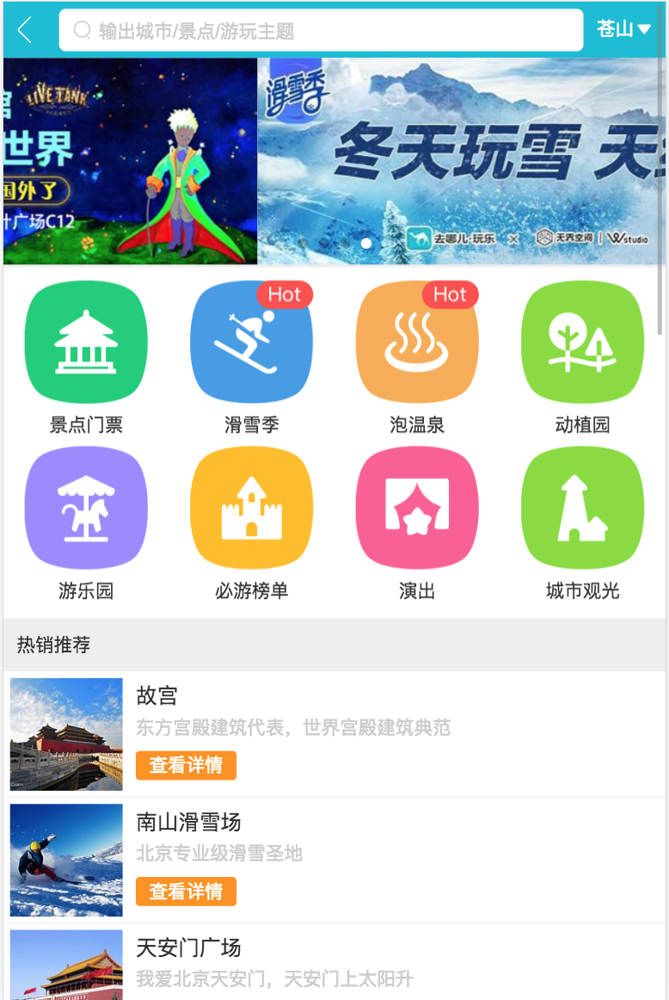

> ### travel-vue (A Vue.js project)
 

#### install dependencies
npm install
  

#### serve with hot reload at localhost:8080 (using webpack-dev-server with vue-cli configuration)
npm run dev
  

#### build for production with minification
npm run build
  

#### serve with self-configured node.js server at localhost:9093 (using built resources for production)
npm run server
  

#### production version deployed at heroku cloud server:
https://songjiuchongtravelvue.herokuapp.com/
  

#### tech-stack for developing Employment-Social-Networking-App(check package.json for details):
Front-end: Vue2.5.2, vue-router3, vuex3, vue-awesome-swiper3, fastclick, axios, better-scroll, stylus, babel-polyfill...
 
Back-end: node + express4, http-proxy-middleware, serve-favicon...
 
Developing tool: Vue-cli, webpack, webpack-dev-server, eslint, babel...
  

#### More Details:
This is a demo for using Vue.js to develop a mobile/desktop App;
 
**You can check 'dev memo.md' for more details if you want to know all the design as well as problem solving during the development;**
  

#### screenshots of the demo:
 

