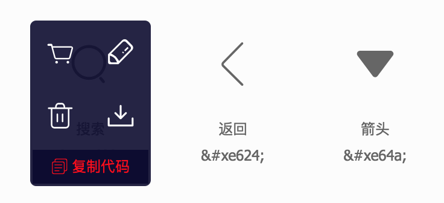
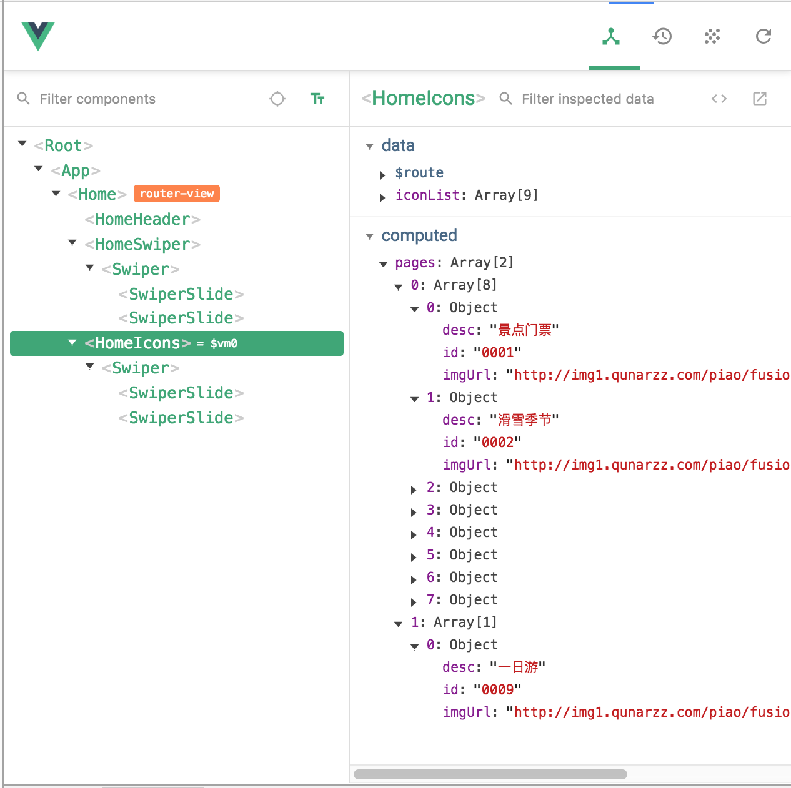

Vue2.5开发去哪儿网App (一);

教学参考:
https://coding.imooc.com/learn/list/203.html

1.相关介绍;

Vue的中文官方文档比较完善, 并且发展也很快, 像NUXT这样用于Vue后端渲染的框架, 包括Weex这样使用Vue来完成移动端开发的框架都在不断推出;

更多基础内容可以参考: ‘Vue.js 2.5;’笔记;

2.Vue基础;

例子:
……
    

      
{{content}}

    

    
……

上例中在页面中加载后会显示hello world, 2秒后显示hello world again;
需要注意的是, 上例中的:app.$data.content = 'hellow world again' , 可以写成: app.content = 'hellow world again’, 效果相同;

之前在‘Vue.js 2.5;’笔记中使用Vue完成了一个todolist的功能模块, 由于Vue是MVVM结构的框架, 而MVVM是基于MVP的框架, 这里将使用jQuery来实现MVP结构的todolist功能模块;

例子:
……
    

      <input id='input' />
      <button id='btn'>提交</button>
      <ul id='list'></ul>
    

    
……

上例中, 使用了jQuery来实现了基于MVP结构的todolist功能, M层并没有在上例中体现, 因为没有使用任何数据模型去获取/存储数据, V层就是html元素, P层在MVP结构项目中是核心层(其中大部分操作属于DOM操作), 它监听V层的用户交互行为并且执行相应的业务逻辑, 然后通过DOM操作去更新页面, 同时它又负责调用数据模型来完成数据的存储与获取:

mvvm(比较典型的应用包括: .NET的WPF，js框架Knockout、AngularJS等)

很显然, mvvm结构使用ViewModel代替了Presenter层, 其实它们的职责是类似的, 只不过使用了mvvm结构的前端框架会自动为开发者实现vm层的功能: 监听视图层的数据变化, 并且更新到ViewModel中, 同时也会检查ViewModel中的数据变化并自动更新到视图层中, 这样就省去了原先在MVP结构项目中的大量DOM操作, 所以可以认为使用了mvvm结构框架的开发者只需要专注于对M层的开发即可(当然M层中会包含业务逻辑和对数据模型的调用);

Vue实例生命周期钩子;

参考:
https://cn.vuejs.org/v2/guide/instance.html#%E7%94%9F%E5%91%BD%E5%91%A8%E6%9C%9F%E5%9B%BE%E7%A4%BA

例子:

var vm = new Vue({
          el: '#app',
          template: '
{{test}}
',
          data: {
            test: 'hello world'
          },
          beforeCreate(){
            console.log('beforeCreate')
          },
          created(){
            console.log('created')
          },
          beforeMount(){
            console.log(this.$el.innerText)  //default
            console.log('beforeMount')
          },
          mounted(){
            console.log(this.$el.innerText)  //hello world
            console.log('mounted')
            var that = this
            var des = function(){
              that.$destroy()
            }
            setTimeout(des,3000)
            this.test = 'updated'
          },
          beforeUpdate(){
            console.log('beforeUpdate')
          },
          updated(){
            console.log('updated')
          },
          beforeDestroy(){
            console.log('beforeDestroy')
          },
          destroyed(){
            console.log('destroyed')
          }
   })

上例中在控制台输出的内容为:
beforeCreate
created
default
beforeMount
hello world
mounted
beforeUpdate
updated

延迟3秒后输出:
beforeDestroy
destroyed

需要注意的是, 当vue实例vm被destroy之后它在页面中已经显示的模板内容以及模板上已经绑定的交互事件会被保留, 但是由于实例对象本身被destroy了(这里的destroy是销毁vm实例对象上绑定的一些功能, 而这个对象本身还是存在的), 所以再次修改vm上的data属性就不会触发页面的更新了(双向数据绑定功能已被移除);

除了上面介绍的8中vue实例的生命周期钩子函数, 其实还有其它三个钩子函数:
activated, deactivated, errorCaptured
之后会介绍;

补充:
1.不要在选项属性或回调上使用箭头函数，比如:
 created: () => console.log(this.a)
 或者
 vm.$watch('a', newValue => this.myMethod())

因为箭头函数是和父级上下文绑定在一起的, this 不会是如你所预期的 Vue 实例对象的引用, 经常导致 Uncaught TypeError: Cannot read property of undefined 或 Uncaught TypeError: this.myMethod is not a function 之类的错误;

Vue的计算属性和侦听器;

例子:
……
    

      {{fullName + ‘ ‘ + age}}
    

    
……

上例中在页面中加载后显示: song jiuchong 29
在控制台执行: vm.age = 28 后, 页面显示更新为: song jiuchong 28
在控制台执行: vm.firstName = 'SONG' 后, 页面显示更新为: SONG jiucong 28, 并且控制台输出: firstName改动触发侦听器
在控制台执行: vm.lastName = ‘JIUCHONG’ 后, 页面显示更新为: SONG JIUCHONG 28, 并且控制台输出: lastName改动触发侦听器

如果上例中开放了vue实例的computed计算属性, 页面加载后会报错:
[Vue warn]: The computed property "fullName" is already defined in data.

所以需要相应删除vue实例的data属性中设置的fullName;

使用了计算属性后, 页面加载后显示: song jiucong 29, 控制台输出: 计算属性被计算一次
在控制台执行: vm.age = 28 后, 页面显示更新为: song jiuchong 28
在控制台执行: vm.firstName = 'SONG' 后, 页面显示更新为: SONG jiucong 28, 并且控制台输出: 计算属性被计算一次
在控制台执行: vm.lastName = 'JIUCHONG' 后, 页面显示更新为: SONG JIUCHONG 28, 并且控制台输出: 计算属性被计算一次

很显然计算属性会在this.firstName和this.lastName这两个输入值没有改变的情况下直接使用缓存的输出值, 代码更简洁, 效率更高;

计算属性的setter/getter;

例子:
……
    

      {{fullName}}
    

    
……

上例中在vue实例中设置了fullName这个计算属性的setter/getter方法, 所以在获取this.fullName时就会通过get方法获取返回值(同样会根据依赖进行缓存), 如果对this.fullName进行赋值操作, 就会调用set方法;
可以这样理解, 直接将某个计算属性设置为一个函数(参考之前设置计算属性的例子), 就相当于只设置了这个计算属性的get方法;
上例在页面加载后显示: song jiucong, 控制台显示: 计算属性get方法被执行
在控制台执行: vm.firstName='SONG' 后, 页面显示为: SONG jiucong, 控制台显示: 计算属性get方法被执行
在控制台执行: vm.lastName=‘JIUCHONG’ 后, 页面显示为: SONG JIUCHONG, 控制台显示: 计算属性get方法被执行
在控制台执行: vm.fullName=‘jiuchong song’ 后, 页面显示为: jiuchong song, 控制台显示: 计算属性set方法被执行 计算属性get方法被执行

可以发现, 当对vue实例的firstName/lastName属性进行修改时, 由于它们是计算属性fullName的依赖, 所以会重新执行一遍fullName的get方法然后更新页面内容;
当对vue实例的计算属性fullName本身进行赋值, 就会执行其set方法, 从而修改了this.firstName/this.lastName这两个它所依赖的属性, 所以又会接着触发一遍get方法,  这也是上例中执行: vm.fullName=‘jiuchong song’ 后控制台显示: ‘计算属性set方法被执行’ ‘计算属性get方法被执行’ 的原因;

Vue中的样式绑定;

(1)Vue中class属性的对象绑定;

例子:
......
    
  </head>
  <body>
    

      
hello world

    

    
......

上例中，Vue实例通过v-bind指令绑定了元素的class属性后，使用了对象的形式为其赋值: {activated: isActivated}, 这种方式会让Vue去判断activated的值为true/false(其它类型的值将会被转换为true/false)，如果为true则在元素上设置class:activated, 如果为false则在元素上设置class(class属性没有任何内容);
所以就实现了点击div元素后其名为activated的样式会被激活/移除的效果;

当然, class属性所绑定的对象中可以有多个属性, 如果上例改为:
......
:class='{activated: isActivated, activatedOne: isActivated}'

那么点击div元素后html中内容为:

hello world

(2)Vue中class属性的数组绑定;

例子:
......
    
  </head>
  <body>
    

      
hello world

    

    
......

上例中，Vue实例通过v-bind指令绑定了元素的class属性后，使用了数组的形式为其赋值: [activated, activatedOne], 这种情况下Vue会将数组中元素视为变量，它会将所有变量的值直接设置为元素上class属性的值，所以上例在页面加载后html中的内容为:

hello world

当点击了div元素后html中的内容为:

hello world

(3)Vue中style属性的对象绑定;

例子:
......
    

      
hello world

    

    
......

上例中，Vue实例通过v-bind指令绑定了元素的style属性后，使用了对象的形式为其赋值: style="styleObj", 这种情况下Vue会通过style对象的形式(类似于react为组件设置style属性的方法)为这个style属性赋值, 所以上例中在页面加载后html为:

hello world

点击div元素后html为:

hello world

(4)Vue中style属性的数组绑定;

例子:
......
:style="[styleObj, {fontSize: '20px'}]"
......

上例中，Vue实例通过v-bind指令绑定了元素的style属性后，使用了数组的形式为其赋值: [styleObj, {fontSize: '20px'}], 这种情况下其实就是将多个style对象放入一个数组, 然后Vue将数组中的所有style对象的值都设置为元素中的样式;
所以上例中在页面加载后html为:

hello world

点击div元素后html为:

hello world

Vue中的条件渲染;

例子1:
......
    

      
{{message}}

      
Bye

    

    
......

上例中使用了v-if和v-else指令, 页面加载后显示: 'Bye'，如果将vm.show设置为true, 那么页面显示:'Hello World'；
需要注意的是, 设置了v-if和v-else指令的标签必须是连续的(当中没有其它标签), 不然会报错, 如果上例改为:
......
      
{{message}}

      
      
Bye

......

页面中报错:

[Vue warn]: Error compiling template:
......
 v-else used on element 
 without corresponding v-if.

例子2:
......
    

      
This is a

      
This is b

      
This is others

    

    
......

上例中在页面显示为: This is a, 当将vm.show设置为'b'后页面显示为: 'This is b', 将vm.show设置为'c'后页面显示为: 'This is others';

例子3:
......
    

      

        用户名: <input />
      

      

        邮箱名: <input />
      

    

    
......

上例中在页面加载后会显示: '邮箱名:'和一个input输入框;
在输入框中输入一些内容后，将vm.show设置为true, 此时页面中会显示: '用户名:'和一个input输入框, 但是输入框中仍旧保留了之前输入的内容;
原因就是Vue的页面更新机制同样会利用virtual dom的diff算法来尽力少的执行dom操作, 所以对于Vue来说, 改变vm的show属性会引起的页面变化只需要将'用户名:'更新为'邮箱名:'即可, <input/>元素在变化前后始终存在无需执行dom操作进行改变, 所以用户之前在input元素中的输入会被保留;

那么解决方法就是为<input/>元素添加key属性， 如:
......
      

        用户名: <input key="username"/>
      

      

        邮箱名: <input key="emailname"/>
      

......

这样当vm.show改变时, Vue会重新渲染页面中的<input/>元素, 那么用户之前在输入框中的输入内容就会被清空了;

Vue的页面更新机制可以参考:
'...'笔记中: ...相关内容;

Vue中的列表渲染;

(1)数组循环;

例子1:
......
    

      

        {{item.text}} --- {{index}}
      

    

    
......

上例中在页面显示为:
hello --- 0
world --- 1

此时如果通过: vm.list[2] = {id:'03', text:"!"} 来改变Vue实例中list属性的内容, 那么页面不会有任何变化, 但是vm.list确实已经被添加了一项元素; 这和之前在介绍Vue的'脏检查'机制时提到的内容相关, 因为Vue在通常情况下是通过===来判断一个属性前后是否发生变化的, 但是对于一个引用类型的值而言, 只要它的地址没有变化, ===对比的结果是相同的, 所以当为一个数组添加一项新的元素时会检测不到前后的变化, 为了解决这个问题, Vue覆写了js原生数组的一些API, 使得用户在执行这些方法时能够让Vue监听到这些变化从而根据新的数据来更新页面内容;

这些被覆写的API为:
push, pop, shift, unshift, splice, sort, reverse;

需要注意的是, 与数据为对象时不同的是, 当Vue实例的一个数据为数组类型时, Vue不会去递归监听数组中每一项元素的变化, 所以如果上例在页面中加载后执行:
vm.list[0] = 'HELLO'

页面同样不会有更新, 所以Vue要覆写: splice, sort, reverse 这三个数组的API;

如果上例中在页面加载后执行: vm.list.splice(0,1,{id:'001',text:'HELLO'}), 那么页面中显示为:
HELLO --- 0
world --- 1

例子2:
......
      <template v-for="(item, index) of list">
        
{{index}}

        {{item.text}}
      </template>
......

上例中使用了template标签来包裹两个需要被循环遍历的子元素, 它的作用是: template标签本身不会被渲染到页面中, 所以html为:

  
0

  hello
  
1

  world

(2)对象循环;

例子:
......
    

      

        {{item}} --- {{key}} --- {{index}}
      

    

    
......

上例中对vm实例中的userInfo对象进行循环遍历, 在页面中显示为:
song --- name --- 0
28 --- age --- 1
male --- gender --- 2

如果上例中改为:

效果相同; 所以Vue中淡化了for of/for in的区别;

如果在页面加载后执行:
vm.userInfo.age = 29

那么页面就会更新为:
song --- name --- 0
29 --- age --- 1
male --- gender --- 2

说明Vue实例会递归监听其对象中每一个属性的变化(与数据类型为数组时不同), 然后更新页面内容;

如果在页面加载后执行:
vm.userInfo.address = 'shanghai'

页面不会有任何变化; 说明Vue并不会监听为其数据对象添加一个新的属性这个操作的变化, 因为这种情况下数据对象本身的值没有发生变化(对象中所有已经存在并被监听的属性的值也没有发生变化);

解决方法可以是:

<1>改变这个数据对象本身的引用(或者使用immutable.js)，如:
vm.userInfo = {name:'song', age: 28, gender:'male', address:'shanghai'}

页面中显示:
song --- name --- 0
28 --- age --- 1
male --- gender --- 2
shanghai --- address --- 3

<2>使用Vue.set()方法;
上例在页面加载后执行:
Vue.set(vm.userInfo,'address','shanghai')

页面中显示同<1>;

<3>使用vue.$set()方法;
除了在<2>中介绍的使用全局的方式在Vue上调用set()方法, 在Vue实例上也可以使用set方法, 如:
上例在页面加载后执行:
vm.$set(vm.userInfo,'address','shanghai')

页面中显示同<1>;

(3)数组循环中使用Vue的set方法;

例子:
......
    

      

        {{item}}
      

    

    
......

Vue的set方法同样也可以用来修改vue实例中数组类型的数据;

上例在页面加载后执行:
Vue.set(vm.userInfo,'4',5)
vm.$set(vm.userInfo,'1','x')

页面显示为:
1
x
3
4
5

Vue组件使用的注意点;

(1)使用is属性来解决浏览器渲染html时可能出现的一些问题;

例子:
......
    

      <table>
        <tbody>
          <row></row>
          <row></row>
          <row></row>
        </tbody>
      </table>
    

    
......

上例在页面中的html为:

  <tr><td>this is a row</td></tr>
  <tr><td>this is a row</td></tr>
  <tr><td>this is a row</td></tr>
  <table><tbody></tbody></table>

可以发现浏览器对html的渲染存在问题, 这是因为h5规定在<table>的<tbody>中一定要使用相关的<tr>标签, 不然就会作为<table>同级渲染在外部, 解决办法是使用Vue的is属性, 上例修改为:
......
    

      <table>
        <tbody>
          <tr is='row'></tr>
          <tr is='row'></tr>
          <tr is='row'></tr>
        </tbody>
      </table>
    

    
......

上例在页面中的html为:

  <table>
    <tbody>
      <tr><td>this is a row</td></tr>
      <tr><td>this is a row</td></tr>
      <tr><td>this is a row</td></tr>
    </tbody>
  </table>

可以发现, 使用了is属性后, 可以让浏览器正确识别tr元素, 之后Vue会将设置了is='row'的tr元素作为row组件进行解析;

同样, 在使用<ul><li></li><ul>这样的元素组合时最好也为<li>元素设置is属性, 如果直接将<li>设置为组件元素, 有些版本的浏览器可能会出现渲染问题;
同理: <select><option></option></select>

(2)data属性的类型;

例子:
......
  

      <table>
        <tbody>
          <tr is='row'></tr>
          <tr is='row'></tr>
          <tr is='row'></tr>
        </tbody>
      </table>
    

    
......

上例在页面中加载后会报错:
The "data" option should be a function that returns a per-instance value in component definitions
......

这是因为在Vue中只有根实例可以将data属性设置为一个对象, 其它子组件都必须将data属性设置为一个返回最终数据对象的函数; 原因是: 根实例只会被初始化一次, 而其它的子组件都可能会被实例化若干次, 所以就需要在每次初始化一个组件实例时可以获取一个全新的data数据对象;

所以上例应该改为:
......
data: function(){
          return {content:'this is row'}
        }
......

(3)在Vue中使用ref属性来进行dom操作(机制与react中的ref属性类似);

虽然Vue已经通过双向数据绑定的机制帮我们完成了大量的dom操作, 但是在某些复杂的情况下(如: 动画演示), 还是需要我们手动操作dom元素的, 而ref属性就是帮助我们进行dom操作的;

例子1:
......
    

      
hello world

    

    
......

上例中, 在页面中点击hello world后控制台显示:
hello world

例子2:
......
    

      <counter ref="counter1" @change='handleChange'></counter>
      <counter ref="counter2" @change='handleChange'></counter>
      
{{total}}

    

    
......

上例通过Vue的ref属性完成了一个计数器, 两个counter子组件在被点击时它们的number属性会自动加1, 而父组件会监听每一次子组件点击后的变化, 并将两个子组件的number属性的值相加后赋给自己的total属性, 从而更新页面中显示的总和;

父子组件之间的数据传递;

在 Vue 中，父子组件的关系可以总结为 prop 向下传递，事件向上传递。父组件通过 prop 给子组件下发数据，子组件通过事件给父组件发送消息;

例子1:
......

      <counter count=0></counter>
      <counter :count='0'></counter>
    

    
......

上例在页面中加载后显示为:
0
0

如果点击某个子组件, 其页面中显示的值会加1; 但是需要特别注意的是, 此时控制台会报错:
[Vue warn]: Avoid mutating a prop directly since the value will be overwritten whenever the parent component re-renders. Instead, use a data or computed property based on the prop's value. Prop being mutated: "count"

这是因为Vue使用单向数据流的形式(与react类似)来更新应用中的数据, 也就是说Vue只希望从父组件传递属性给子组件, 而子组件无法将属性的变化直接反馈给父组件(防止造成数据流的混乱); 而上面的警告所表明的意思是, 如果一个子组件修改了从父组件接收到的props属性, 那么当这个props属性为引用类型时, 父组件由于数据的变化被重新render, 而如果子组件此时选择不重新render而保留当前数据, 那么子组件中的引用类型的props数据将被覆盖;
另外, 避免在子组件中修改接收到的props属性还有一个非常重要的原因, 因为如果这个props属性是引用类型的, 那么一旦某个子组件修改了这个props属性其中的内容, 那么所有接收了相同父组件传递的这个props属性的子组件都会受到影响;

上例中还有一点需要注意的是, 在counter组件上设置count=0与:count='0'的作用相同(都将传递一个数字类型而非字符串类型的值), 因为设置为:count会将'0'引号中的内容当成js表达式来解析;

为了避免报错, 将上例修改为:
......
      var counter = {
        props: ['count'],
        data: function(){
          return {
            number: this.count
          }
        },
        template: '
{{number}}
',
        methods: {
          handleClick: function(){
            this.number++
          }
        }
      }
......

例子2:
......
    

      <counter count=0 @inc='handleInc'></counter>
      <counter :count='0' @inc='handleInc'></counter>
      
{{total}}

    

    
......

组件参数校验与非props特性;

例子1:
......
  

      <child content='hello world'></child>
    

    
......

上例中子组件通过props属性来接收父组件传递的数据, 但是与之前不同的是, props属性被设置为了对象而不是数组, 通过这种方式就能进行对接收到的props属性的类型验证了;
上例如果修改为:
......
<child :content='123'></child>
......

那么页面虽然还是能够正确显示(子组件还是接收了这个数字类型的props属性), 但是控制台会报错:
[Vue warn]: Invalid prop: type check failed for prop "content". Expected String, got Number.

当然, 这个类型检测可以接收多个值, 如:
......
    props: {
          content: [String,Number]
        },
......

例子2:
......
    

      <child></child>
    

    
......

上例中在页面显示:
default value

并且在控制台报错:
[Vue warn]: Missing required prop: "content"

如果上例改为:
<child :content='123'></child>

那么页面显示:
123

并且在控制台报错:
[Vue warn]: Invalid prop: type check failed for prop "content". Expected String, got Number.

例子3:
......

      <child :content="'abc'"></child>
    

    
......

上例在页面中显示为:
abc

并且控制台报错:
[Vue warn]: Invalid prop: custom validator check failed for prop "content".

Props特性和非Props特性;

上例中对content属性的使用就是属于Props特性, 因为它满足了一个条件:
父组件在子组件上定义了某个属性, 子组件本身通过props属性来接收了这个属性;
这种情况下在页面加载后html为:

  
abc

可以发现content属性并没有出现在渲染后的页面标签中, 这就是Props特性; 当然另一个Props特性是能够在子组件中使用接收到的props属性;

而非Props特性指的是当父组件在子组件上设置了一个属性, 但是子组件内部并没有通过props属性来接收这个属性, 那么此时就属于非Props特性, 这种情况下是无法在子组件中使用这个属性的, 并且页面加载后的html为:

  

可以发现这个content属性被显示在了渲染后的页面标签中;

组件绑定原生事件;

例子1:
......
    

      <child @click="handleClick"></child>
    

    
......

上例在页面加载后点击child组件会在控制台输出:
child click

上例说明在组件模板上直接定义的事件都属于自定义事件, 如上例中的:
<child @click="handleClick"></child>

这个click事件并非原生的click事件, 而被Vue理解为一个名为click的自定义事件, 需要子组件使用$emit()主动触发才能被父组件接收;

而在子组件中定义的click事件:

child

由于是在原生标签上定义的, 所以会被Vue解释为一个原生的click事件, 所以可以触发对应的handleClick方法输出:
child click

所以如果将上例子组件中的handleClick方法改为:
......
  handleClick: function(){
            console.log('child click')
            this.$emit('click')
          }
......

那么在页面加载后点击child组件控制台输出:
child click
click

例子2:
......
    

      <child @click.native="handleClick"></child>
    

    
......

上例中使用了@click.native这样的click事件绑定方式来告知Vue这个设置在组件元素上的事件是原生事件而非自定义事件, 所以就可以省去了像例子1中那样通过子组件向外emit一个自定义事件来让父组件执行点击事件回调函数这么繁琐的过程;

上例在页面加载后点击child组件在控制台显示:
click

非父子组件间的传值;

在Vue中, 如果涉及到了非父子组件之间的数据传递, 就需要使用Vuex框架或者Vue的总线(Bus)机制(发布/订阅模式);

例子:
......
    

      <child content="one"></child>
      <child content="two"></child>
    

    
......

上例中使用了Vue.prototype.bus = new Vue() 语句在Vue这个类的原型上定义了一个bus属性, 这个属性指向一个统一的Vue实例; 之后初始化的任何Vue实例都可以获取到这个bus属性;

因为这个bus属性所有Vue实例都能够获取, 而在一个Vue实例上又可以通过$emit和$on方法来订阅/发布某个特定事件并传递数据, 所以这种方式就是解决Vue中非父子组件之间传值的好办法;

上例通过子组件的点击事件在bus实例对象上触发了一个change事件, 并传递了数据, 之后又在这个bus实例对象上监听了change事件来更改子组件自己的myContent属性;

所以当页面加载后点击某一个子组件时, 在bus这个实例对象上会先触发一个对应的change事件, 然后bus对象自己监听到了这个change事件于是触发了两个回调函数, 分别修改了两个子组件自己的myContent属性;
所以当点击one时, 页面中显示:
one
one

当点击two时, 页面中显示:
two
two

在Vue中使用插槽;

例子1:
......
    

      <child content="
a

b

c
"></child>
    

    
......

上例中想通过父元素传递给子元素一些需要在其模板中显示的html数据, 为了不被转义, 所以只能通过:

这样的形式来插入模板, 需要注意的是, 这里如果使用:
<template v-html="this.content"></template>
页面中不会渲染这个template标签中的内容;

那么上例中的这种方式虽然能在页面中显示正确的内容, 但是既不方便阅读和扩展, 并且结构上多了一个
元素, 所以需要更加好的解决方法;

Vue有一个插槽功能可以解决这类问题(类似react中this.props.children的机制);

例子2:
......
    

      <child>
        
world

        
!

      </child>
    

    
......

上例在页面中的html为:

  

    
hello

    
world

    
!

  

需要注意的是, <slot>标签中还可以指定默认值, 如:
......
  <child>
  </child>
......
<slot><h1>default</h1></slot>
......

只有当child组件元素中没有写入任何内容的情况下这个默认值才会被渲染;

例子3:
......
    

      <body-content>
        
header

        
footer

      </bodu-content>
    

    
......

上例中使用了'具名插槽'这个功能来实现了父组件传递多个插槽给子组件渲染的效果;
上例在页面中的html为:

  
header

  
content

  
footer

当然, 具名插槽也可以设置默认值, 如:
<slot name="header">default header</slot>
那么当父元素没有传递一个带有属性: slot="header" 的元素时, 子组件中设置了name="header"的slot元素就会渲染为默认值;

需要注意的是, 上例中如果将'content'定义为子组件的名称会报错:
[Vue warn]: Do not use built-in or reserved HTML elements as component id: content

作用域插槽;

例子:
......
    

        <child>
          <template slot-scope="props">
            <h1>{{props.item}}</h1>
          </template>
        </child>
    

    
......

上例在页面中的html为:

  

    <ul>
      <h1>1</h1>
      <h1>2</h1>
      <h1>3</h1>
      <h1>4</h1>
      <h1>5</h1>
    </ul>
  

作用域插槽的作用其实就是:
当子组件中需要被渲染的内容一部分需要由父组件传递的插槽决定, 还有一部分需要由子组件自己的数据决定, 这种情况下就需要父组件定义所需传递给子组件的插槽的同时接收子组件传递的数据, 这样才能完整地展示插槽的内容;
上例中需要解决的问题就是:
子组件中需要循环展示其list数组中的内容, 但是用来循环展示内容的元素类型又需要父组件通过插槽来决定(上例中使用了h1, 但是也可以为li或其他指定值), 由于<slot>的机制所限定, 子组件中不可能通过类似: <slot>{{item}}</slot> 这样的形式来既接收了父组件传递的插槽元素, 又能将它自己的数据放入到插槽中展示, 所以就需要一个功能来让父元素结合子元素需要显示的数据来定义插槽内容;

需要注意的是, 上例中父元素中指定template元素并在其中指定slot-scope属性这种方式是固定格式, 相当于将子元素中指定的<slot>替换为了:
<template v-for="item of list">
  <h1>{{item}}</h1>
</template>

那么显然slot-scope这个属性所获取的就是子元素设置的<slot>的作用域了(它的所有属性), "props"这个值可以随意定义, 它代表的就是<slot>的作用域, 所以可以通过props.item获取子元素在<slot>上设置的:item=item这个属性的值;

动态组件和v-once指令;

例子1:
……
   

      <child-one v-if="type === 'child-one' "></child-one>
      <child-two v-if="type === 'child-two' "></child-two>
      <button @click="handleClick">change</button>
    

    
……

上例中实现了一个toggle子组件的功能;
在页面加载后显示: child-one
当点击change按钮后页面中显示: child-two

例子2:
……

  <component :is="type"></component>
        <button @click="handleClick">change</button>

……

例子2与例子1在页面中的效果完全相同;
component是Vue的一个内置组件, 称为动态组件, 它通过is属性来决定哪个组件被渲染;

参考:
https://cn.vuejs.org/v2/api/#component

例子3:
……
        Vue.component('child-one',{
          template: '
child-one
'
        })
        Vue.component('child-two',{
          template: '
child-two
'
        })
……

上例中在两个子组件中添加了v-once指令(页面中效果与例子1,2相同), 它的作用是: 一旦组件被渲染后就会被缓存在内存中, 如果之后组件被销毁后重新创建就会直接从内存中获取已经保存的内容, 而无需重新创建, 能够在一定程度上提高性能;
需要注意的是, 设置了v-once指令的元素和组件只会被渲染一次, 随后的重新渲染, 元素/组件及其所有的子节点将被视为静态内容并跳过; 这可以用于优化更新性能;

参考:
https://cn.vuejs.org/v2/api/#v-once

v-once指令与Vue的内置组件keep-alive作用类似(主要用于保留组件状态或避免重新渲染), 参考:
https://cn.vuejs.org/v2/api/?#keep-alive

Vue中的CSS动画原理(实现过渡效果);

Vue的transition组件机制类似react的react-addons-css-transition-group组件(其实它的功能与之后要提到的transition-group更类似);

例子:
……
    
  </head>
  <body>
    <noscript>
      You need to enable JavaScript to run this app.
    </noscript>
    

      <transition name="fade">
        
hello world

      </transition>
      <button @click="handleClick">toggle</button>
    

    
……

上例中, Vue会分析被<transition name=“fade”>组件包裹元素的状态, 并且执行以下动作:
<1>当元素被渲染时;
在动画开始执行时(动画第一帧), Vue会为被包裹元素添加: fade-enter和fade-enter-active这两个样式;
当动画第一帧结束后, Vue会在动画的第二帧中把元素上的fade-enter样式移除, 并添加一个fade-enter-to样式;
当动画结束时(最后一帧), Vue会移除元素上剩下的两个样式: fade-enter-to和fade-enter-active;
<2>当元素被移除时;
在动画开始执行时(动画第一帧), Vue会为被包裹元素添加: fade-leave和fade-leave-active这两个样式;
当动画第一帧结束后, Vue会在动画的第二帧中把元素上的fade-leave样式移除, 并添加一个fade-leave-to样式;
当动画结束时(最后一帧), Vue会移除元素上剩下的两个样式: fade-leave-to和fade-leave-active;

其实就是利用css3的transition样式属性来监听opacity的变化(过渡动画效果), 一旦有变化了就根据指定的时长执行动画效果;

所以上例中设置的样式能够让被<transition name=“fade”>组件包裹的
元素实现渐入/渐出效果;

注意:
1.上例中在<transition>中指定的name="fade”决定了Vue将会为其中元素添加的样式名称为类似: fade-enter这样的形式, 如果不指定name属性, 那么Vue默认会使用的样式是类似: v-enter, v-leave-active这样的形式;
2.在<transition>中还可以自定义Vue将会添加的enter/leave样式的名称格式, 如:
……
    
  </head>
  <body>
    <noscript>
      You need to enable JavaScript to run this app.
    </noscript>
    

      <transition name="fade"
                  enter-active-class="enter"
                  leave-active-class="leave">
        
hello world

      </transition>
      <button @click="handleClick">toggle</button>
    

……

上例在页面的效果与之前的例子相同;

3.上例中如果将被<transition name=“fade”>组件包裹的元素中v-if指令改为v-show指令, 动画效果仍旧生效; 另外, 在<transition>中使用动态组件也同样能够展示对应效果;

在Vue中使用animate.css库(实现动画效果);

例子1:
……    
  </head>
  <body>
    <noscript>
      You need to enable JavaScript to run this app.
    </noscript>
    

      <transition name="fade">
        
hello world

      </transition>
      <button @click="handleClick">toggle</button>
    

    
……

上例中使用了Vue的transition组件配合CSS3的@keyframes/animation来实现了元素放大/缩小的动画效果;

例子2:

下载animate.css后引入index.html
……
   <link rel="stylesheet" type="text/css" href="./animate.css"/>
    
  </head>
  <body>
    <noscript>
      You need to enable JavaScript to run this app.
    </noscript>
    

      <transition
        enter-active-class="animated swing"
        leave-active-class="animated shake"
      >
        
hello world

      </transition>
      <button @click="handleClick">toggle</button>
    

    
……

上例中使用了Vue的transition组件配合animate.css库来实现指定元素入场/出场的动画效果;
需要注意的是, 如果要让Vue的transition组件使用animate.css库, 就必须使用自定义样式名(enter-active-class/leave-active-class)的方式, 并且样式名需要以animated开头, 后面跟需要使用的animate.css中的动画名(https://daneden.github.io/animate.css/ 首页可以查看并测试所有动画效果);
其实transition组件上的enter-active-class/leave-active-class属性就是用来设置在被包裹元素出/入场时实际添加/删除的类名, 上例中的设置方法其实就是在元素入场时为其添加/删除样式类:
class=‘animated swing’
在其出场时为其添加/删除样式类:
class=‘animated shake’

而这两个类指定的动画样式可以在animate.css源码中查看;

关于css3中animation的用法, 参考:
http://www.css88.com/book/css/properties/animation/animation.htm (重要)
https://developer.mozilla.org/zh-CN/docs/Web/CSS/transform-origin (重要, transform-origin用法)

animate.css
https://daneden.github.io/animate.css/ (官网, API)

上例中页面加载后并不会展示任何动画效果, 只有在用户点击toggle按钮后才会显示动画效果, 如果这里需要页面在加载后就让div元素展示入场的动画效果就需要设置:
……
      <transition
        appear
        appear-active-class="animated swing"
        enter-active-class="animated swing"
        leave-active-class="animated shake"
      >
……

需要注意的是, appear这个属性必须设置, 它告诉transition组件开启对其包裹的组件首次渲染时的动画展示功能, 并且通过appear-active-class属性指定了动画类型;

例子3:
……
    <link rel="stylesheet" type="text/css" href="./animate.css"/>
    
  </head>
  <body>
    <noscript>
      You need to enable JavaScript to run this app.
    </noscript>
    

      <transition
        name="fade"
        appear
        appear-active-class="animated swing"
        enter-active-class="animated swing enter"
        leave-active-class="animated shake leave"
      >
        
hello world

      </transition>
      <button @click="handleClick">toggle</button>
    

    
……

上例中通过:
enter-active-class="animated swing enter"
leave-active-class="animated shake leave"

让transition组件通过animate.css中的动画样式为包裹元素设置了入场/出场动画, 同时又自定义了名为enter/leave的两个出/入场样式, 让transition组件在动画展示生命周期中添加/删除这两个样式, 这样用户就可以在使用animate.css库的同时自定义一些出/入场效果了;

上例中被transition组件包裹元素上同时会展现animate.css和用户自定义的动画效果;

这里会存在一个问题, 因为Vue的transition组件是以其v-enter-active/v-leave-active中设置的动画时长做为依据来决定动画效果的生命周期的(经过多次时间才会移除所有相关样式), 那么上例中自定义的enter/leave样式类中指定的动画时长为2s, 而animate.css中在.animated类里设置的动画时长默认为1s:
……
.animated {
  -webkit-animation-duration: 1s;
  animation-duration: 1s;
  -webkit-animation-fill-mode: both;
  animation-fill-mode: both;
}
……

此时transition组件就可能会无法正确判断动画效果的具体生命周期长度, 所以需要手动指定:
……
<transition
        type="transition"
        name="fade"
        appear
        appear-active-class="animated swing"
        enter-active-class="animated swing enter"
        leave-active-class="animated shake leave"
      >
……

上例中通过在transition组件上指定type="transition”来告诉Vue以transition这个样式属性设置的时长为准;

当然也可以指定具体的时长, 如:
……
<transition
        :duration="5000"
        name="fade"
        appear
        appear-active-class="animated swing"
        enter-active-class="animated swing enter"
        leave-active-class="animated shake leave"
      >
……

或者
……
<transition
        :duration="{enter:3000, leave:5000}"
        name="fade"
        appear
        appear-active-class="animated swing"
        enter-active-class="animated swing enter"
        leave-active-class="animated shake leave"
      >
……

需要注意的是, 上例中指定的是transition组件所包裹元素的动画效果生命周期持续长度, 也就是说, 用户之前指定的animate.css的动画样式依旧会在1s后结束, 通过transition过渡样式属性指定的动画效果依旧会在2s后结束, 但是transition组件对元素上相关样式的移除会在用户指定的duration后才执行(被transition组件所管理的元素/组件的移除动作也会因为动画生命周期的长度而推迟);

Vue中的JS动画与Velocity.js的结合使用;

Vue的transition组件除了能够借助为包裹元素添加/删除css样式来实现动画效果, 还提供了一些js动画钩子;

例子1:
……
   

      <transition
        name="fade"
        @before-enter="handleBeforeEnter"
        @enter="handleEnter"
        @after-enter="handleAfterEnter"
      >
        
hello world

      </transition>
      <button @click="handleClick">toggle</button>
    

    
……

上例中在transition组件上设置了3种js动画钩子函数:
before-enter
enter
after-enter

需要注意的是, 这三个钩子函数都会将被包裹元素的元素对象做为第一个参数传入函数, 而enter函数会接收第二个参数, 这个参数是一个函数, 只有当这个函数被执行时transition组件才会认为enter动画已经执行完毕, 才会去触发after-enter这个钩子;

所以上例在页面中的效果是:
当用户第二次点击toggle按钮时hello world重新显示在页面上, 并且字体为红色, 过了2s后字体变为绿色, 又过了1s后字体变回黑色;

例子2:
……
    

      <transition
        name="fade"
        @before-leave="handleBeforeLeave"
        @leave="handleLeave"
        @after-leave="handleAfterLeave"
      >
        
hello world

      </transition>
      <button @click="handleClick">toggle</button>
    

    
……

上例中使用了leave动画的3种js动画钩子:
before-leave
leave
after-leave

它们的机制与enter动画的3个钩子对应相同;

所以上例在页面中的效果为:
页面中显示hello world, 字体为黑色, 当用户第一次点击toggle按钮时字体变为红色, 2s后字体变为绿色, 又过了1s后hello world消失, 当用户再次点击toggle按钮后hello world重新显示, 字体为黑色;

例子3:

下载velocity.js;
……
    
  </head>
  <body>
    <noscript>
      You need to enable JavaScript to run this app.
    </noscript>
    

      <transition
        name="fade"
        @before-enter="handleBeforeEnter"
        @enter="handleEnter"
        @after-enter="handleAfterEnter"
      >
        
hello world

      </transition>
      <button @click="handleClick">toggle</button>
    

    
……

上例中结合了Vue的transition组件和Velocity.js来实现了元素入场的动画效果;

补充:
1.velocity.js配合jQuery使用;
replace all instances of jQuery's $.animate() with $.velocity(). You will immediately see a performance boost across all browsers and devices — especially on mobile.

参考:
http://velocityjs.org/ (官网)
http://www.mrfront.com/docs/velocity.js/index.html (中文文档)

Vue中多个元素/组件的过渡效果;

注意:
这里的多个元素指的是它们之间存在互相切换的效果, 也就是说同一时刻只会有一个元素/组件存在于transition组件中;
transition组件只能处理一个单一的元素/组件(同一时间只能处理一个动画生命周期), 所以只有当多个元素/组件存在互相切换的条件时才能在transition组件中设置多个元素/组件;

例子1:
……
    
  </head>
  <body>
    <noscript>
      You need to enable JavaScript to run this app.
    </noscript>
    

      <transition mode='out-in'>
        
hello world

        
bye

      </transition>
      <button @click="handleClick">toggle</button>
    

    
……

上例中实现的效果是:
页面加载后显示hello world, 当用户第一次点击toggle按钮后hello world逐渐隐藏, bye逐渐显示, 完成交替; 当用户再次点击toggle按钮后, bye逐渐隐藏, hello world逐渐显示, 完成交替;

需要注意的是, 上例中如果不在transition组件包裹的div元素上设置key属性, 那么就不会展示过渡效果, 因为Vue在更新组件时会尽力复用模板中没有改变的部分, 所以只会更新页面中div元素的内容, 而不会移除/重新渲染这个div元素, 而transition组件是依据其所包裹元素/组件是否被移除/重新渲染(或者根据display样式属性进行显示/隐藏)来判断是否启动入场/出场的动画生命周期的, 所以上例中需要给被包裹的两个div元素添加key属性来让Vue在组件更新时移除/重新渲染div元素来开启动画生命周期;

上例中在transition组件中设置了mode属性, 这个属性用来设置当同时存在入场/出场动画效果需要被展示时transition组件处理的规则;
上例中的mode=‘out-in’的作用是: 让出场动画先执行, 完成后再展示入场动画;
如果mode=‘in-out’, 那么入场动画会先执行, 完成后在展示出场动画;
需要注意的是, 这里的出场动画生命周期执行完毕指的是: 需要被移除/隐藏的元素/组件上所有出场相关样式类被移除, 并且这个元素/组件被从页面上真正移除后再执行入场动画生命周期(包括将元素/组件添加到页面上这个动作);

例子2:
……
    
  </head>
  <body>
    <noscript>
      You need to enable JavaScript to run this app.
    </noscript>
    

      <transition mode='out-in'>
        <component :is='type'></component>
      </transition>
      <button @click="handleClick">toggle</button>
    

    
……

上例中使用了动态组件配合transition组件实现了组件之间切换显示的过渡效果(与例子1中切换效果类似);
需要注意的是, 如果是动态组件之间的切换, 那么Vue将一定会移除/重新渲染对应组件, 而不会去检查复用任何组件的template内容, 所以无需指定key属性;

Vue中的列表过渡;

例子:
……
   
  </head>
  <body>
    <noscript>
      You need to enable JavaScript to run this app.
    </noscript>
    

      <transition-group>
        
{{item.title}}

      </transition-group>
      <button @click="handleClick">add</button>
    

    
……

上例中使用了transition-group组件来实现对多个元素/组件实现过渡动画的效果, 之前提到过transition组件只能处理单一的元素/组件的动画效果, 所以如果上例中将transition-group标签改为transition, 会报错:
[Vue warn]: <transition> can only be used on a single element. Use <transition-group> for lists.

上例实现的效果是:
当用户点击add按钮后就会在页面中添加一项内容为hello world的div元素, 并且存在入场动画效果;

其实transition-group的原理是将其中包裹的多个单一元素用多个transition组件包裹起来, 如:
<transition-group>
  
1

  
2

  
3

</transition-group>

相当于:
<transition>
  
1

</transition>
<transition>
  
2

</transition>
<transition>
  
3

</transition>

Vue中的动画封装(可复用的动画效果);

例子:
……
    

      <fade :show='show'>
        <h1>hello world</h1>
      </fade>
      <button @click="handleClick">toggle</button>
    

    
……

上例中使用了fade组件封装了一个入场的动画效果, 可以直接调用这个组件来实现相关过渡效果, 使用方法是: 为fade组件传入一个名为show的属性来指定需要动画效果的元素的显示状态, 并且以slot的形式传入需要实现动画效果的元素即可;
需要注意的是, 在<slot>标签中只能通过v-if这个条件指令来决定插槽对应的元素是否被渲染, v-show指令无效(不会添加display样式属性);

Vue中状态过渡动画可以参考(数据变化的过渡动画):
https://cn.vuejs.org/v2/guide/transitioning-state.html

……

Vue2.5开发去哪儿网App (二);

……

3.项目环境配置;

(1)在码云创建账户并新建一个private repo:
https://gitee.com/songjiuchong/TravelVue

绑定SSH key:
https://gitee.com/profile/sshkeys
如何生成/查看现有SSH key:
http://git.mydoc.io/?t=154712

添加完成后:

补充:
1.上面提到的SSH key相关命令都需要在linux中使用(MAC终端可以直接使用), window操作系统中(无法使用cmd来执行这些命令)使用git bush就相当于启动了一个小型的linux终端, 就可以使用linux命令了;

(2)在本地创建与gitee关联的repo;

$ cd mygitee
$ git clone git@gitee.com:songjiuchong/TravelVue.git

……

这个项目这里还是使用github来保存代码;
……

(3)使用vue-cli开发Vue项目;

类似于开发react项目时使用的: create-react-app 这个命令行工具一样, Vue项目也需要使用对应的命令行工具: vue-cli

$ npm install -g vue-cli
$ vue init webpack TravelVue
$ cd TravelVue
$ npm run dev

……

安装vue-cli参考:
https://github.com/vuejs/vue-cli

补充:
1.执行vue init指令时可能会有warning:
xcode-select: error: tool 'xcodebuild' requires Xcode, but active developer directory '/Library/Developer/CommandLineTools' is a command line tools instance

这个warning可以忽略;

参考:
https://github.com/nodejs/node-gyp/issues/569

(4)查看当前项目结构;

观察项目中src/main.js这个入口js文件的内容:

import Vue from 'vue'
import App from './App'
import router from './router'

Vue.config.productionTip = false

new Vue({
  el: '#app',
  router,
  components: { App },
  template: '<App/>'
})

在根实例中定义了router这个属性, 它指定了整个项目的路由;
而App这个组件属于入口单文件组件;

src/router/index.js;

import Vue from 'vue'
import Router from 'vue-router'
import HelloWorld from '@/components/HelloWorld'

Vue.use(Router)

export default new Router({
  routes: [
    {
      path: '/',
      name: 'HelloWorld',
      component: HelloWorld
    }
  ]
})

上例中使用了'@/components/HelloWorld’这样的路径, 代表了绝对路径:
‘TravelVue/src/components/HelloWorld’

webpack在解析路径时会根据 TravelVue/build/webpack.base.conf.js中的配置:
……
function resolve (dir) {
  return path.join(__dirname, '..', dir)
}
……
  resolve: {
    extensions: ['.js', '.vue', '.json'],
    alias: {
      'vue$': 'vue/dist/vue.esm.js',
      '@': resolve('src'),
    }
  },
……

来获取@代表的路径内容;

关于__dirname的用法, 可以参考:
’Page Dev helper’笔记中’184.关于Node.js的__dirname，__filename，process.cwd()，./文件路径的注意点;’相关内容;

src/App.vue;

<template>
  

    
    <router-view/>
  

</template>
……

可以发现这个入口单文件组件定义了<router-view/>这个元素, 它会根据当前路径来渲染页面内容;

(5)修改项目结构;

删除src/components文件夹, 新建src/pages/home/Home.vue;

<template>
  
home

</template>

修改src/router/index.js;

import Vue from 'vue'
import Router from 'vue-router'
import Home from '@/pages/home/Home'

Vue.use(Router)

export default new Router({
  routes: [
    {
      path: '/',
      name: 'Home',
      component: Home
    }
  ]
})

在http://localhost:8080/ 中观察页面, 页面显示: home;
但是控制台有warnings:
./src/pages/home/Home.vue
]50;CurrentDir=/Users/jiusong/mygit/TravelVue
  ✘  http://eslint.org/docs/rules/indent  Expected indentation of 0 spaces but found 2
  src/pages/home/Home.vue:7:1
    export default {
   ^

  ✘  http://eslint.org/docs/rules/indent  Expected indentation of 2 spaces but found 4
  src/pages/home/Home.vue:8:1
      name: 'Home'
   ^

  ✘  http://eslint.org/docs/rules/indent  Expected indentation of 0 spaces but found 2
  src/pages/home/Home.vue:9:1
    }

这是因为在单文件组件中设置:

时对输出内容前添加了空格, 将空格删除即可, 如:

(6)修改项目根目录下的index.html;
……
<meta name="viewport" content="width=device-width,initial-scale=1.0,minimum-scale=1.0,maximum-scale=1.0,user-scalable=no">
……

这样设置以后, 当用户使用移动设备访问项目页面时是无法通过触摸操作放大或者缩小页面大小的, 页面显示比例始终为1:1;

(7)引入reset.css来统一移动端浏览器的默认样式;

由于不同移动端设备的浏览器可能存在初始默认样式不统一的情况, 所以需要使用一个统一的标准来初始化页面样式;

下载reset.css, 放在src/assets/styles/reset.css;

reset.css源文件参考:
https://gitee.com/dell-lee/Travel/blob/master/src/assets/styles/reset.css

修改main.js;
…..
import './assets/styles/reset.css'
……

(8)引入border.css来解决移动端的’1像素边框问题’;

因为devicePixelRatio(设备像素比: 设备上物理像素和设备独立像素的比例)的不同, 在像素较高的移动端设备上可能会存在’1像素边框问题’, 也就是说, 如果在这样的移动端中使用类似:
border: 1px solid red;

时, 虽然开发者指定的是1px(css 像素), 实际显示的是多个物理像素的宽度(因为css像素对应的是设备的独立像素, 而一个独立像素可以由多个物理像素组成, 所以在更加清晰的页面中会显得很宽);

‘1px边框问题’出现的原因, 可以参考:
https://www.cnblogs.com/momozjm/p/7248937.html

所以其实大多数情况下的需求是: 让css中的1px边框在移动设备上显示1px的物理像素(而不是独立像素), border.css就是通过@media来根据不同的device-pixel-ratio然后配合使用transform: scale()来解决这个问题的;

border.css源文件参考:
https://gitee.com/dell-lee/Travel/blob/master/src/assets/styles/border.css

关于’1px边框问题’可以参考:
’Page Dev helper’笔记中: ‘187.移动端的1px边框问题以及解决办法;’中相关内容;

关于devicePixelRatio可以参考:
’Page Dev helper’笔记中: ‘130.响应式图片; ‘中补充部分相关内容;

修改main.js;
…..
import './assets/styles/border.css'
……

(9)安装fastclick包来解决移动端的’300毫秒点击延迟问题’;

在某些机型的移动端设备上可能会出现’300毫秒点击延迟问题’, 也就是说, 在这些机型的浏览器上使用click事件时, 事件会延迟300ms然后再执行;
原因是: 移动浏览器上支持的双击缩放操作，以及IOS Safari 上的双击滚动操作，用户可以进行双击缩放或者双击滚动的操作，所以当用户一次点击屏幕之后，浏览器并不能立刻判断用户是确实要打开这个链接，还是想要进行双击操作; 因此，浏览器就等待 300 毫秒，以判断用户是否再次点击了屏幕;

安装fastclick;
$ npm install fastclick --save

修改main.js;
……
import fastClick from 'fastclick'
……
fastClick.attach(document.body)
……

补充:
1.解决移动端click事件300ms延迟的所有方法;

参考:
https://www.jianshu.com/p/16d3e4f9b2a9 (重要)

更多关于click事件300ms延迟和点击穿透的问题可以参考: ‘Page Dev helper’笔记中 ‘189.移动端的click事件300ms延迟以及点击穿透问题的原因和解决办法;’相关内容;

(10)在iconfont上新增一个自定义项目;

http://www.iconfont.cn/manage/index?spm=a313x.7781069.1998910419.11&manage_type=myprojects&projectId=687423

4.项目首页header区域开发;

页面布局, 样式参考:
http://piao.qunar.com/touch/

(1)安装stylus/stylus-loader;

$ npm install stylus —save
$ npm install stylus-loader —save

(2)创建src/pages/home/components/Header.vue;

<template>
  

    
返回

    
输出城市/景点游玩主题

    
城市

  

</template>

上例中使用lang='stylus’来告诉webpack(设置了相应的vue-loader), 需要使用stylus-loader来解析css样式;

这里假设提供给开发者的项目页面的mock是一个2倍图, 也就是说, 这张mock图是实际移动设备中页面显示的2倍大小(与设备的DPR无关); 假设在mock中测量header的高度是86px, 那么这个header在实际设备上显示的高度应该是43px的独立像素(对应43px的css像素), 所以为了方便之后定义大小, 这里在reset.css中设置了:
html {font-size: 50px}

这样设置的目的是可以直接使用测量mock所得的像素值来设置css像素值, 比如上面提到的css 像素应该为43px的header高度, 这里就可以直接设置为0.86rem了, 因为0.86rem就等于43px;

上例中设置了.header-right的宽度为1.24rem, 那么它在移动设备上实际显示的独立像素为62px(物理像素为124px);

需要注意的是, 实际开发中提供的移动端页面的mock一般是根据独立像素来设计的, 也就是说, 如果mock和实际移动端页面是1:1的情况下, 根据提供的mock测量出的像素对应的应该是移动设备实际显示页面时的独立像素;

(3)使用iconfont添加图标;

在iconfont的图标库->官方图标库中选择一些之后需要使用的图标添加到购物车, 然后点击购物车将其中所有图标添加到之前创建的项目中, 来到项目中点击下载至本地;

下载后解压, 获得的文件列表为:

其中demo开头的文件, 和.js文件不需要;

将iconfont.css放入src/assets中;
将剩下的4个字体文件放入src/assets/styles/iconfont文件夹;

由于所有字体文件被放入了iconfont文件夹, 所以需要修改iconfont.css中指定的路径;
……
@font-face {font-family: "iconfont";
  src: url(‘./iconfont/iconfont.eot?t=1527680114687'); /* IE9*/
  src: url(‘./iconfont/iconfont.eot?t=1527680114687#iefix') format('embedded-opentype'), /* IE6-IE8 */
  url('data:application/x-font-woff;charset=utf-8;base64,…...+ULS0xL6M0k604v7S4NJ+BAQB9BAjaAAA=') format('woff'),
  url(‘./iconfont/iconfont.ttf?t=1527680114687') format('truetype'), /* chrome, firefox, opera, Safari, Android, iOS 4.2+*/
  url(‘./iconfont/iconfont.svg?t=1527680114687#iconfont') format('svg'); /* iOS 4.1- */
}
……

修改main.js;
……
import './assets/styles/iconfont.css'
……

修改Header.vue;

<template>
  

    

      &#xe624;
    

    
输出城市/景点/游玩主题

    
城市

  

</template>
……

上例中通过&#xe624;添加了一个字体图标, 其中元素的内容: &#xe624; 可以在iconfont网站上通过复制对应图标的代码获取;

另一种使用方法是根据iconfont.css中定义的所下载图标的样式类来声明图标, 如:

iconfont.css
……
.icon-jiantou:before { content: "\e64a"; }

.icon-fanhui:before { content: "\e624"; }

.icon-sousuo:before { content: "\e632"; }

修改Header.vue;

<template>
  

    

      
&#xe624;

    

    

      <i class="iconfont icon-sousuo"></i>
      输出城市/景点/游玩主题
    

    

      城市
      <i class="iconfont icon-jiantou arrow-icon"></i>
    

  

</template>

页面中效果:

(4)将项目的主要颜色采用stylus变量的形式单独定义, 增强复用性和可维护性;

在src/assets/styles中创建variables.styl文件;
$bgColor = #00bcd4

然后在Header.vue中使用@import引入它, 然后就可以直接使用$bgColor这个变量了:
…..

上例中基于swiper组件创建了一个单文件组件Swiper.vue, 设置了两张轮播图;

swiper组件在单文件组件中的用法, 参考:
https://github.com/surmon-china/vue-awesome-swiper#spa

修改Home.vue;

<template>
  

    <home-header></home-header>
    <home-swiper></home-swiper>
    
test

  

</template>

……

上例中在header组件下引入了Swiper.vue中设置的轮播组件, 并且又添加了一个测试用的div元素, 目的是测试页面加载时轮播组件是否会造成抖动效果;

测试方法:
在chrome浏览器的Developer Tools中Network选项中, 点击右上角的online按钮后选择: Fast 3G, 然后刷新页面查看效果(目的是测试网速较慢时页面加载的效果);

可以发现, 当页面加载时由于图片下载较慢, 轮播组件初始情况下没有高度, 所以div元素中的test显示在了header组件之下, 之后图片下载完成后轮播组件才会被’撑开’正常显示, 所以会有一个’抖动’的效果, 用户体验有影响;

解决方法:

修改Swiper.vue;
……
<template>
  

    <swiper :options="swiperOption">
      <swiper-slide>
        
      </swiper-slide>
      <swiper-slide>
        
      </swiper-slide>
      

    </swiper>
  

</template>
……

上例中在<swiper>组件外包裹了一层div元素, 并且为其设置了相关的样式, 其中padding-bottom: 52.46% 的功能是根据父元素宽度的52.46%来撑开一个高度(相当于一个占位元素, 去除了抖动效果), 而这个52.64%是根据图片的实际大小的高/宽比计算出来的, 这样就能满足无论页面宽度是多少, 这个占位元素所占的高度都会是轮播图加载后所占的高度;
并且设置了一个background背景色, 让图片还未加载完全时显示一个灰色占位背景;

上例中, 277/528 = 0.5246…

补充:
1.上例中使用的知识点是: 当margin/padding取形式为百分比的值时, 无论是left/right还是top/bottom 都是以父元素的width为参照物;
参考:
https://segmentfault.com/a/1190000004231995
2.padding-bottom并不会阻止内部元素的溢出, 所以上例中虽然.wrapper元素设置了overflow: hidden, 但是padding-bottom部分还会能够显示’溢出’的内容(如果内部元素溢出了padding-bottom所设置的区域, 那么超出部分还是会被隐藏), 达到了占位元素的效果;

那么既然padding-bottom不会影响内部元素的溢出, 也就是说无论如何内部元素都会覆盖这部分内容, padding-bottom到底什么时候会被用到呢?
其实关键就在于设置了padding-bottom的元素是否指定了高度, 如果没有指定高度, 那么其内部元素就会不断撑开父元素而满足padding-bottom指定的区域不被覆盖, 所以此时内部元素不会’溢出’到padding-bottom所指定的区域, 但是如果父元素指定了具体的高度, 那么它就不会被子元素撑开, 所以子元素就会’溢出’到父元素指定的padding-bottom区域了;
而上例中由于父元素指定了height为0, 所以它的高度不会被撑开, 也就是说, 只有它指定的padding-bottom区域可以显示子元素的内容;
3.上例中其实还可以通过设置.wrapper元素的height: 52.46vw 来达到相同的效果, 不过由于是css3的特性, 浏览器兼容性不够好;

这样就能够防止页面的’抖动’了;

(4)为轮播图添加pagination(分页点);

根据修改vue-awesome-swiper设置来开启pagination功能;

修改Swiper.vue;
……

……

但是这里需要将选中状态的pagination点改为白色的, 所以试着根据页面中对应元素的样式修改:

修改Swiper.vue;
……

……

修改后发现pagination点还是蓝色的, 样式并没有生效;
原因是: 在Swiper.vue这个单文件组件中通过
……

上例中使用’>>>’这样的语法来进行样式的’穿透’, 作用是为当前组件中的.wrapper元素下的所有子组件中指定了.swiper-pagination-bullet-active的元素设置样式而不受scoped属性的限制;

(5)优化轮播图的设置方式并添加循环展示功能;

修改Swiper.vue;

<template>
  

    <swiper :options="swiperOption">
      <swiper-slide v-for="item of swiperList" :key="item.id">
        
      </swiper-slide>
      

    </swiper>
  

</template>

……

上例中除了使用v-for来遍历生成swiper-slide组件外, 还对swiper组件设置了: loop: true 来让轮播图可以循环展示(滑动到第二张图片后继续向左滑动又显示第一张图片, 向右滑动时同理);

补充:
1.上例中vue-awesome-swiper实现轮播图循环展示的原理;

上例中通过定义loop:true让swiper组件开启了循环展示轮播图的功能, 观察页面加载时的html:

可以发现, 其实swiper组件为了达到效果, 生成了4个swiper-slide组件(上例中设置了2张轮播图), 假设我们指定的两个swiper-slide组件中的图片分别为1和2, 那么开启了loop功能的swiper组件生成的4个swiper-slide组件中包含的图片分别为: 2 1 2 1, 这样设置的目的是为了让用户在某一张图片上向左/向右滑动时都能逐渐展示另一张图片来达到循环展示的效果:

在页面刚加载时显示的是第二个swiper-slide组件中的图片1, 此时用来包裹所有swiper-slide组件的swiper-wrapper组件中设置的transform属性为: translate3d(-602px, 0px, 0px); 其中在x轴上的-602px就是为了在页面加载时从第一个swiper-slide组件(图片2)变化到第二个swiper-slide组件从而显示图片1, 并且保证了此时图片1所在的swiper-slide组件的左侧和右侧为两个包含了图片2的swiper-slide组件;
所以此时当用户在当前展示的第二个swiper-slide组件(图片1)上向左/向右滑动时, swpier组件会监听到用户的动作, 并且会相应改变swiper-wrapper组件上设置的transform属性translate3d的x轴坐标: 如果用户向左滑动(x轴向左), 那么坐标会依据用户滑动的距离相应变小, 向右滑动(x轴向右)则坐标相应变大;

需要注意的是, 当用户在初始展示的第二个swiper-slide组件(图片1)向右滑动直到展示了整个第一个swiper-slide组件(图片2)后, swiper-wrapper组件中的transform为: translate3d(0px, 0px, 0px), 那么此时这个swiper-slide组件的左侧是没有其它swiper-slide组件可以展示的, 所以这种情况下当用户在这个swiper-slide组件上触发了任何滑动事件后, swiper组件会立即通过设置swiper-wrapper组件的transform:translate3d样式来将当前的这个第一个swiper-slide组件(图片2)变化为第三个swiper-slide组件(图片2), 保证了当前这个swiper-slide组件的左侧和右侧都有swiper-slide组件(图片1)可以展示(这个变化过程是瞬间的, 用户不会察觉到这一变化), 这样用户再向右滑动时就能展示这第三个swiper-slide组件(图片2)左侧的第二个swiper-slide组件(图片1)了;
同理, 当用户滑动并停留在最后一个, 也就是第四个swiper-slide组件(图片1)时, 它的右侧没有其它的swiper-slide组件可以展示, 所以此时如果用户再次在这第四个swiper-slide组件(图片1)上触发滑动事件时, swiper组件就会通过设置swiper-wrapper组件的transform:translate3d样式来将当前的第四个swiper-slide组件(图片1)变化为第二个swiper-slide组件(图片1)...

这也就是为什么我们只设置了两张需要展示的轮播图, 但是在开启了loop功能后swiper组件会按照一定规则和顺序自动生成4个swiper-slide组件的原因;

6.首页图标区域;

(1)新建src/pages/home/components/Icons.vue;

<template>
  

    

      

        
      

      
热门景点

    

  

</template>

上例中主要利用了float: left, width配合padding-bottom样式属性完成了图标区域2X4(行X列)的图标布局;

需要注意的是, 上例为 .icon-img元素设置了position: absolute; 并且指定了全部的top,bottom,left,right四个方位的值之后就会撑开一个有具体高度和宽度的占位元素(如果不设置left/right那么只有具体高度, 不设置top/bottom就只有具体的宽度), 所以它的子img元素 .icon-img-content 就可以通过指定height: 100%来显示了;
由于p元素 .icon-desc与.icon-img元素同级, 所以为了可以在.icon元素的底部位置上显示, 也需要设置为position: absolute; 并且无须指定top, 但是需要指定bottom:0;
所以, 它们的父元素(绝对定位的参照元素)需要设置 position: relative;

还有一点需要注意的是, 上例中为.icon-img元素设置了 box-sizing: border-box, 也就是说此时如果为.icon-img元素指定高度的话, 那么.icon-img元素的实际的content部分高度和上下两个padding的高度相加为这个指定的高度, 这种情况下如果不设置box-sizing: border-box, 那么.icon-img元素的content部分高度就会达到指定的高度, 然后还会再多出上下两个padding的高度;
而上例中并没有为.icon-img元素指定高度, 而是通过为其设置position: absolute的top,bottom,left,right四个方位的值来获得了一个高度和宽度, 这种情况下再为其设置padding属性时就会无视box-sizing的类型而缩小.icon-img元素的content的宽/高来满足这个padding的值, 也就是说.icon-img元素实际所占的空间不会改变, 仍旧由position: absolute的四个方位值来决定, 但是其content所占空间大小分给了padding, 所以自己变小了;
所以就上例(页面在chrome中加载)而言, 无论box-sizing: border-box是否指定页面效果都相同;

关于box-sizing, 参考:
http://www.cnblogs.com/zhaoran/archive/2013/05/24/3097482.html

最后需要说明的一点是, 无论父元素的box-sizing设置为什么类型, 子元素的高度/宽度如果设置为百分比的话都是根据父元素content部分的高度/宽度做为参照的, 当然条件是子元素相对父元素不是绝对定位, 如果是绝对定位, 那么高度/宽度的百分比时根据父元素content+padding部分作为参照的;

修改variables.styl;
……
$darkTextColor = #333



(2)图标区域完整设计;

修改Icons.vue;

<template>
  

    <swiper>
      <swiper-slide v-for="(page, index) of pages" :key="index">
        

          

            
          

          
{{item.desc}}

        

      </swiper-slide>
    </swiper>
  

</template>

上例中仍旧需要通过vue-awesome-swiper插件来完成图标区域的滑动轮播显示效果;
其实要实现图标区域的滑动轮播需要两个swiper-slide组件, 因为每个组件最多包裹8个图标元素, 所以上例中在Icons组件中设置了一个computed数据属性:pages来根据现有图标的个数决定具体需要渲染几个swiper-slide组件, 每个swiper-slide组件中又需要渲染哪些图标元素;

需要注意的是, Icons组件中的数据属性iconList代表了当前需要展示在页面中的图标总数, 目前其中的内容都是写死的, 之后将改为通过API获取;
所以computed属性pages的作用就是来为iconList中的所有内容重新定义数据结构以方便被swiper组件以及其包裹的.icon元素遍历渲染;
值得注意的是, 上例在模板中使用了嵌套的v-for循环语句;

上例的样式设置中, 通过: .icons >>> .swiper-container 来指定了轮播的滑动区域为整个图标区域;
.swiper-container元素其实就是swiper组件渲染后的最外层元素, 它自带了overflow: hidden; 样式属性;

(3)实现元素中文字内容过长时使用’…’来展示的样式;

上图中由于文字内容过多, 所以在.icon-desc这个
元素中显示不完全;

解决办法:

新建src/assets/styles/mixins.styl;

ellipsis()
  overflow: hidden
  white-space: nowrap
  text-overflow: ellipsis

修改Icons.vue;
……

上例中通过列表的形式构建了首页推荐模块的内容, 其中比较关键的是这个组件的样式设计;

需要注意的是, 由于这个推荐模块中希望每一个推荐项目之间通过border-bottom来分割, 而之前提到了’1px 边框的问题’并且引入了border.css做为解决方案, 所以这里只需要在<li>元素上添加一个已经在border.css中定义好的样式’border-bottom’即可:
<li class="item border-bottom" v-for="item of recommendList" :key="item.id">

上例中设置样式时有个小技巧, 就是当某个元素(如: 上例中的.title, .item-title和.item-desc元素)中只有文字内容需要显示, 同时希望在指定元素高度的同时文字垂直居中, 那么此时只需要设置line-height为期望的元素高度即可, 无效设置height, 因为这种情况下height就等于line-height;

上例中为了在.item-title和.item-desc元素中内容超出显示范围时能够以’…’展示, 所以引入了ellipsis这个stylus的mixins, 但是需要注意的是, 由于上例中在.item-title和.item-desc元素外层使用了flex布局, 所以只设置ellipsis时.item-title和.item-desc元素中的’…’不会生效, 解决办法是在它们的外层元素.item-info上添加min-width: 0即可;

修改Home.vue;
……
    <home-icons></home-icons>
    <home-recommend></home-recommend>
……
import HomeRecommend from './components/Recommend'
……
  components: {
    HomeHeader,
    HomeSwiper,
    HomeIcons,
    HomeRecommend
  }
……

8.首页’周末游’组件开发;

周末游’组件的基本结构与’推荐’组件类似;

新建src/pages/home/components/Weekends.vue;

<template>
  

    
周末去哪儿

    <ul>
      <li class="item border-bottom" v-for="item of recommendList" :key="item.id">
        

          
        

        

          
{{item.title}}

          
{{item.desc}}

        

      </li>
    </ul>
  

</template>

由于结构类似, 上例中的’周末游’组件只在’推荐’组件的基础做了一些修改;
上例中用div元素.item-img-wrapper对每个img元素.item-img做了一层包裹, 这层div元素根据img元素包含图片的固定宽/高比(640x214)利用height: 0和padding-bottom: 33.9% 样式做了占位, 所以img元素只需要设置width: 100%就能够撑满这个占位空间实现原生比例展示;

修改Home.vue;
……
    <home-recommend></home-recommend>
    <home-weekend></home-weekend>
……
import HomeWeekend from './components/Weekend'
……
  components: {
    HomeHeader,
    HomeSwiper,
    HomeIcons,
    HomeRecommend,
    HomeWeekend
  }
……

9.通过Ajax来获取首页中的数据;

(1)安装axios;

$ npm install axios —save

(2)让Home.vue组件接收数据;

由于Home.vue下的若干个子组件都需要通过请求数据来渲染页面内容, 那么如果在每个子组件中请求一次, 那么效率相对就会比较低, 所以这里在Home.vue这个组件中统一请求数据, 然后再将数据传递给子组件;

修改Home.vue;
……
import axios from 'axios'
export default {
  name: 'Home',
  components: {
    HomeHeader,
    HomeSwiper,
    HomeIcons,
    HomeRecommend,
    HomeWeekend
  },
  methods: {
    getHomeInfo () {
      axios.get('/api/index.json')
        .then(this.getHomeInfoSucc)
    },
    getHomeInfoSucc (res) {
      console.log(res)
    }
  },
  mounted () {
    this.getHomeInfo()
  }
}
</script>
……

上例中通过了axios插件来进行Ajax请求, 请求路径是: ‘/api/index.json’, 这里的路径将会根据不同环境进行适配(通过配置转发路径), 这样可以无需在上线前手动修改路径;

由于vue-cli这个工具使用webpack-dev-server创建的本地服务器中默认只有static文件夹中的内容可以直接访问(访问其它路径直接加载项目首页), 所以这里将模拟访问后端服务器获取的数据放在项目根目录下的static/mock/index.json中;

(3)设置dev环境的请求代理;

修改config/index.js;
……
module.exports = {
  dev: {

    // Paths
    assetsSubDirectory: 'static',
    assetsPublicPath: '/',
    proxyTable: {
      '/api': {
        target: 'http://localhost:8080',
        pathRewrite: {
          '^/api': '/static/mock'
        }
      }
    },
……

上例中通过在vue-cli提供的用来配置本地服务器的config文件中添加proxyTable属性来开启webpack-dev-server对项目中请求的转发, 其中proxyTable的内容代表: 当项目对应的webpack-dev-server接收到的请求路径为’/api’时, 会将请求路径替换为: ‘http://localhost:8080/static/mock’ 并且转发请求, 最后将接收到的响应内容返回给项目客户端;

也就是说通过vue-cli的本地服务器(http://localhost:8080)运行项目时Home.vue中的请求路径其实为: ‘http://localhost:8080/static/mock/index.json’, 上线后的请求路径就是: 项目所在的server地址 + ’/api/index.json’;

修改static/mock/index.json;
……
static/mock/index.json源码获取:
https://gitee.com/dell-lee/Travel/blob/master/static/mock/index.json#

修改.gitignore;
……
static/mock
……

Home.vue中接收到的数据;

10.首页父子组件之间的数据传递;

之前介绍了通过axios来让Home.vue接收所有首页模块中需要用到的数据, 这里将通过数据传递让Home.vue的子组件获取相应数据;

修改Home.vue;

<template>
  

    <home-header :city="city"></home-header>
    <home-swiper :list="swiperList"></home-swiper>
    <home-icons :list="iconList"></home-icons>
    <home-recommend :list="recommendList"></home-recommend>
    <home-weekend :list="weekendList"></home-weekend>
  

</template>

……

上例中, 在Home.vue组件中通过ajax请求获取了所有主页上需要展示的数据, 然后将数据分类设置在data属性上, 通过props传递给子组件;

修改Header.vue;

<template>
  

    

      
&#xe624;

    

    

      <i class="iconfont icon-sousuo"></i>
      输出城市/景点/游玩主题
    

    

      {{city}}
      <i class="iconfont icon-jiantou arrow-icon"></i>
    

  

</template>

……

上例中需要注意的是, 设置在template中的数据{{city}}与写成{{this.city}}作用相同, 但是在
……

上例中指定了一个computed属性showSwiper, 用来计算当前的list属性是否为空数组, 如果是空数组说明还未接收到真正的数据, 就不去渲染swiper组件, 因为swiper组件目前存在一个问题是: 如果它首先渲染了一个空数组(也就是不存在任何的swiper-slide组件), 之后通过update又需要渲染多个swiper-slide组件时, 就会出现循环展示无效, 初始展示的轮播图为最后一张图片等问题;
还需要注意的一点是, 虽然如果上例子中设置: <swiper :options="swiperOption" v-if="list.length”>效果相同, 但是在开发模板时需要尽量保证不适用逻辑计算代码, 所以将计算length这个操作放在组件中;

修改Icons.vue;

<template>
  

    <swiper :options="swiperOption">
      <swiper-slide v-for="(page, index) of pages" :key="index">
        

          

            
          

          
{{item.desc}}

        

      </swiper-slide>
    </swiper>
  

</template>

……

修改Recommend.vue;

<template>
  

    
热销推荐

    <ul>
      <li class="item border-bottom" v-for="item of list" :key="item.id">
        
        

          
{{item.title}}

          
{{item.desc}}

          <button class="item-button">查看详情</button>
        

      </li>
    </ul>
  

</template>

……

修改Weekend.vue;

<template>
  

    
周末去哪儿

    <ul>
      <li class="item border-bottom" v-for="item of list" :key="item.id">
        

          
        

        

          
{{item.title}}

          
{{item.desc}}

        

      </li>
    </ul>
  

</template>

……

……

Vue2.5开发去哪儿网App (三);

……

11.城市选择页面的路由配置;

(1)为城市选择页面新增路由设置;

修改src/router/index.js;

import Vue from 'vue'
import Router from 'vue-router'
import Home from '@/pages/home/Home'
import City from '@/pages/city/City'

Vue.use(Router)

export default new Router({
  routes: [
    {
      path: '/',
      name: 'Home',
      component: Home
    }, {
      path: '/city',
      name: 'city',
      component: City
    }
  ]
})

(2)在Header.vue组件中添加到城市选择页面的路由跳转;

修改Header.vue;

<template>
  

    

      
&#xe624;

    

    

      <i class="iconfont icon-sousuo"></i>
      输出城市/景点/游玩主题
    

    <router-link to='/city'>
      

        {{city}}
        <i class="iconfont icon-jiantou arrow-icon"></i>
      

    </router-link>
  

</template>
……

上例中在.header-right元素外层包裹了<router-link>组件并执行’/city’这个路由路径, 页面加载后.header-right元素中的文字会变为绿色, 这是因为<router-link>组件其实会为.header-right元素外层包裹一个指向’/city’的<a>标签, 而这个<a>标签的默认color属性为: #25a4bb;

所以需要修改.header-right样式:
……
    .header-right
      width: 1.24rem
      float:right
      text-align: center
      color: #fff
……

(3)新建src/pages/city/City.vue;

<template>
  <CityHeader></CityHeader>
</template>

(4)新建src/pages/city/components/Header.vue;

<template>
  

    城市选择
    <router-link to="/">
      
&#xe624;

    </router-link>
  

</template>

在首页上点击.header-right元素就会跳转到城市选择页面, 点击左上角的back-icon又会回到首页;

12.城市选择页中的搜索框;

修改City.vue;
……
    <city-header></city-header>
    <city-search></city-search>
……
import CitySearch from './components/Search'
……
  components: {
    CityHeader,
    CitySearch
  }

新建src/pages/city/components/Search.vue;

<template>
  

    <input class="search-input" type="text" placeholder="输入城市名或拼音" />
  

</template>

可以发现, 我们在设置单文件组件的stylus样式时都没有使用过类似: -webkit- 这样的厂商前缀, 这是因为vue-cli的设置会让webpack使用vue-loader, 而vue-loader依赖了postcss这个插件(autoprefixer的功能), 它会自动添加必要的兼容性厂商前缀;

13.城市选择页中的列表布局;

修改City.vue;
……
    <city-search></city-search>
    <city-list></city-list>
……
import CityList from './components/List'
export default {
  name: 'City',
  components: {
    CityHeader,
    CitySearch,
    CityList
  }
}
……

新建src/pages/city/components/List.vue;

<template>
  

    

      
当前城市

      

        

          
上海

        

      

    

    

      
热门城市

      

        

          
上海

        

      

    

    

      
A

      

        
阿拉尔

      

    

  

</template>

注意:
1.上例中的stylus样式里使用了:
……
  .border-topbottom
    &:before
      border-color: #ccc
    &:after
      border-color: #ccc
……

来改变border.css里设置的伪元素边框的颜色, 其中字符’&’的作用是指向父选择器, 所以&:before就相当于: .border-topbottom:before, &:after就相当于: .border-topbottom:after, 但是不会做为这个父级选择器的子级作用, 也就是说, 上例相当于设置了:

.border-topbottom:before
  border-color: #ccc
.border-topbottom:after
  border-color: #ccc

而不是:
.border-topbottom
  .border-topbottom:before
    border-color: #ccc
  .border-topbottom:after
    border-color: #ccc

2.stylus的API;

参考:
http://www.zhangxinxu.com/jq/stylus/selectors.php (中文)
http://stylus-lang.com/ (官方网站)

3.上例中由于对.button-wrapper元素设置了float:left;样式, 所以.button-list元素(没有设置height)会发生高度塌陷的问题, 解决方法就是在.button-list元素上添加overflow: hidden 来触发它的BFC;

关于BFC与清除浮动, 可以参考:
’Page Dev helper’笔记中’129.BFC相关问题;’相关内容;

4.上例中使用了overflow: hidden配合position: absolute来让.list元素无法通过滚动来展示’溢出’部分的内容, 从而让页面的滚动操作失效(滚动条消失, 并且页面中header/footer的内容不会因为整个页面的滚动而被隐藏)来模仿原生APP的效果, 之后会通过一个scroll插件来实现只有.list元素内部可以通过滚动来查看’溢出’部分内容的效果;

上例中如果没有设置.list相关的样式, 那么由于.list元素中内容过多(假设在其中添加了许多内容)整个页面可以被滚动浏览, 并且会出现滚动条:

如果此时将.list的背景颜色设置为红色, 观察页面:

可以发现, 由于.list并没有将超出页面的部分视为’溢出’的内容, 所以.list中所有的内容(包括通过滚动才能展示的内容)都是红色的;
所以这种情况下就算为.list元素添加overflow: hidden样式, 效果相同;

如果此时为.list添加position: absolute 相关样式后, 观察页面:

可以发现, 当元素设置为position: absolute之后, 超出了页面的内容被.list元素视为了’溢出’的内容, 所以并没有用红色渲染, 虽然此时还是可以通过滚动展示其’溢出’的内容;

如果此时再为.list添加overflow:hidden样式, 观察页面:

此时无法通过滚动页面来查看.list中’溢出’的内容了, 滚动条也不存在了, 这就是我们需要的模仿原生APP的效果;
之后会通过一个scroll插件来实现只有.list元素内容可以通过滚动来展示’溢出’部分内容的效果, 这样就不会让页面的头部内容因为滚动而隐藏了;

14.Better-scroll的使用以及字母表布局;

(1)安装better-scroll;

$ npm install better-scroll —save

参考:
https://github.com/ustbhuangyi/better-scroll (官方github)

(2)添加一层包裹元素;

为了符合better-scroll的使用格式:

  <ul class="content">
    <li>...</li>
    <li>...</li>
    ...
  </ul>
  <!-- you can put some other DOMs here, it won't affect the scrolling -->

这里需要在.list元素下再添加一层div元素做为’content’;

(3)修改List.vue;
……
<template>
  

    

      

        
当前城市

……

……

上例中在List.vue组件内引入了Better-scroll插件, 并且基于.list元素创建了一个新的Better-scroll实例;
其实上例中的: this.scroll = new Bscroll(this.$refs.wrapper) 改为 new Bscroll(this.$refs.wrapper)效果相同;

这样当用户在页面拖拽时就可以展示.list中’溢出’的内容了, 并且这个拖拽不会造成整个页面的滚动(默认情况下也不会显示滚动条, 并且当拖拽到顶部/底部时会有弹性效果), 所以不会影响.list元素外其它元素的位置;

需要注意的是, 要让使用了better-scroll插件的元素能够正常发挥其滚动展示’溢出’内容的效果, 需要满足两点:
<1>这个元素设置了overflow:hidden, 或者说满足此元素中溢出的内容在正常情况下不会影响到其它外部元素的显示; 如果不满足这个条件, 那么通过better-scroll滚动展示元素中’溢出’部分内容时会超出元素范围而覆盖其它外部的元素;
<2>这个元素拥有具体的高度(无论是通过指定height或者是通过绝对定位来撑开一个具体的高度), 如果这个元素没有具体高度那么better-scroll就不会让其有滚动效果;

(4)新建src/pages/city/components/Alphabet.vue;

<template>
  <ul class="list">
    <li class="item">A</li>
    <li class="item">B</li>
    <li class="item">C</li>
    <li class="item">D</li>
    <li class="item">E</li>
    <li class="item">F</li>
    <li class="item">G</li>
    <li class="item">H</li>
  </ul>
</template>

上例中通过绝对定位和flex布局完成了一个纵向居中展示内容的字母表(字母表的内容后续会通过循环完成);

修改City.vue;
……
    <city-list></city-list>
    <city-alphabet></city-alphabet>
……
import CityAlphabet from './components/Alphabet'
export default {
  name: 'City',
  components: {
    CityHeader,
    CitySearch,
    CityList,
    CityAlphabet
  }
}
</script>
……

15.城市选择页面的动态数据渲染;

(1)在项目根目录新增static/mock/city.json;
……

city.json源文件:
https://gitee.com/dell-lee/Travel/blob/master/static/mock/city.json#

(2)修改City.vue;
……
    <city-list :cities="cities" :hot="hotCities"></city-list>
    <city-alphabet :cities="cities"></city-alphabet>
  

</template>

……

观察city.json传递的数据:

(3)修改List.vue;

<template>
  

    

      

        
当前城市

        

          

            
上海

          

        

      

      

        
热门城市

        

          

            
{{item.name}}

          

        

      

      

        
{{key}}

        

          
{{innerItem.name}}

        

      

    

  

</template>

……

上例中使用了: v-for="(item, key) of cities” 来遍历一个对象而不是数组, 需要注意的是此时遍历获取的是(item, key)而不是遍历数组时的(item, index);
上例中其实可以使用created钩子函数替换mounted, created(触发顺序类似于react的componentWillMount)是beforeMount之前的一个钩子函数, 但是最好还是将ajax操作放在mounted函数中执行;

(4)修改Alphabet.vue;

<template>
  <ul class="list">
    <li class="item" v-for="(item, key) of cities" :key="key">{{key}}</li>
  </ul>
</template>

……

16.城市选择页面中Alphabet字母表与城市列表联动(兄弟组件之间的联动);

这里由于是两个同级兄弟组件(List.vue/Alphabet.vue)之间的联动, 所以采取最简单的方式:
Alphabet.vue通过事件将数据传递给父组件(City.vue), 父组件监听到事件后将获得的数据通过props的形式再传递给List.vue;

修改Alphabet.vue;

<template>
  <ul class="list">
    <li
      class="item"
      v-for="(item, key) of cities"
      :key="key"
      @click="handleLetterClick"
    >{{key}}</li>
  </ul>
</template>

……

上例中监听了字母表中每个字母元素的点击事件, 并且将字母内容做为数据通过’change’事件发布出去;

修改City.vue;

<template>
  

    <city-header></city-header>
    <city-search></city-search>
    <city-list
      :cities="cities"
      :hot="hotCities"
      :letter="letter"></city-list>
    <city-alphabet
      :cities="cities"
      @change="handleLetterChange"
    ></city-alphabet>
  

</template>
……
data () {
    return {
      cities: {},
      hotCities: [],
      letter: ''
    }
  },
……
    handleLetterChange (letter) {
      this.letter = letter
    }
……

上例中父组件通过在Alphabet组件上监听’change’事件来获取子组件传递的数据, 然后将这个数据通过props传递给List.vue;

修改List.vue;
……
      

……
  props: {
    hot: Array,
    cities: Object,
    letter: String
  },
  mounted () {
    this.scroll = new Bscroll(this.$refs.wrapper)
  },
  watch: {
    letter () {
      if (this.letter) {
        const element = this.$refs[this.letter][0]
        this.scroll.scrollToElement(element)
      }
    }
  }
……

上例中List.vue组件通过props获取了从父组件传递的数据, 然后通过watch方法监听这个数据的变化, 一旦改变就通过better-scroll插件提供的scrollToElement方法让对应的.area元素滚动到.list元素的最顶端;
需要注意的是, 上例中通过v-for在.area元素上设置ref属性后其实在this.$refs上创建了若干个与.area元素相关的数组而不是对象(与一般情况不同), 所以不能通过this.$refs[this.letter]来获取, 需要通过this.$refs[this.letter][0]来获取到真正的dom元素对象;

不过上例存在一个问题, 那就是如果点击同一个字母多次, 第二次点击并不会触发City.vue组件的update, 当然子组件List.vue中相应的watch方法也不会被触发, 所以就不能再次滚动到相应的位置了;

解决方法是:
在City.vue的handleLetterChange方法中为letter数据添加一个随机数, 强制让City.vue每次都更新, 同时子组件List.vue也能够通过watch方法来让对应区域发生滚动了;

修改City.vue;
……
    handleLetterChange (letter) {
      let date = new Date()
      this.letter = letter + Math.floor(Math.random() * (11)) + date.getTime()
    }
……

修改List.vue;
……
  watch: {
    letter () {
      if (this.letter) {
        let letterNeeded = this.letter[0]
        const element = this.$refs[letterNeeded][0]
        this.scroll.scrollToElement(element)
      }
    }
  }
……

目前字母表只能通过点击来触发与城市列表的联动, 这里希望同时能够通过在字母表上触发滑动触摸/拖拽事件来与城市列表联动;

修改Alphabet.vue;

<template>
  <ul class="list">
    <li
      class="item"
      v-for="item of letters"
      :key="item"
      :ref="item"
      @touchstart="handleTouchStart"
      @touchmove="handleTouchMove"
      @touchend="handleTouchEnd"
      @click="handleLetterClick"
    >{{item}}</li>
  </ul>
</template>

……

上例中通过computed属性定义了一个只包含26个字母的数组, 方便之后的计算;
上例中为了保证让touchmove事件发生在touchstart事件之后, 所以声明了一个数据属性标识: touchStatus; 这样做的目的有待研究;
上例中定义的startY其实就是从.list元素顶部到第一个.item元素的垂直距离;
上例中定义的touchY是通过当前触摸事件所在的元素距离页面顶部的垂直距离减去整个header部分的垂直距离(79px)而获得的;
最后通过Math.floor((touchY-startY)/20)就可以获取当前touchmove事件所在元素对应的下标了, 其中20是每个.item元素(也就是字母对应元素)的高度;
其实关键逻辑就是需要通过touchmove事件获取当前触发事件所在元素与第一个.item元素(也就是A字母对应元素)之间的垂直距离;

补充:
1.offsetTop为只读属性, 它返回当前元素相对于其 offsetParent 元素的顶部的距离;
2.offsetParent 是一个只读属性，返回一个指向最近的（closest，指包含层级上的最近）包含该元素的定位元素。如果没有定位的元素，则 offsetParent 为最近的 table, table cell 或根元素（标准模式下为 html；quirks 模式下为 body）。当元素的 style.display 设置为 "none" 时，offsetParent 返回 null。offsetParent 很有用，因为 offsetTop 和 offsetLeft 都是相对于其内边距边界的;

参考:
https://developer.mozilla.org/zh-CN/docs/Web/API/HTMLElement/offsetParent

3.touchmove事件会传递一个事件对象e给回调函数, 这个对象的结构如下:

上例中就是通过e.touches[0].clientY来获取当前触摸事件所在元素距离页面顶部的距离的;

不过, 上面这样的设计在性能方面可能会有问题;

(1)在touchmove事件每次触发时都会去计算一遍: const startY = this.$refs['A'][0].offsetTop;
(2)由于用户在Alphabet组件上滑动期间touchmove事件触发的频率非常高, 这里需要通过节流的方法一定程度上限制事件触发的频率;

所以这里需要修改Alphabet.vue;
……

……

上例中之所以在组件的updated这个钩子函数中定义startY这个属性, 原因是:
当Alphabet组件第一次被加载时获取到的其实是City.vue传递过来的空对象: cities, 所以页面上不会渲染任何内容, 然后当City.vue中指定的ajax请求返回之后组件会被update, 所以Alphabet也会被update从而获取到了最新的cities, 当Alphabet模板的内容被更新到页面中之后就会立即触发它的updated钩子函数(对应于react的componentDidUpdate), 此刻其实是组件最早能够通过this.$refs['A'][0].offsetTop在浏览器中获取到正确的数据的时刻, 所以会选择在updated钩子函数中定义startY;
还有一点需要注意的是, 其实上例中可以选择不在data函数中声明timer: null 这个数据属性, 因为this.timer这个操作只是为了保存一个timer对象, 而不需要通过this.$data.timer来监听它的变化从而更新组件, 不过就Alphabet组件而言就算它被update也不会发生dom操作去更新页面;

17.城市选择页面中搜索功能的实现;

修改City.vue;
......
<city-search :cities="cities"></city-search>
……

修改Search.vue;

<template>
  

    

      <input v-model="keyword" class="search-input" type="text" placeholder="输入城市名或拼音" />
    

    

      <ul>
        <li class="search-item border-bottom" v-for="item of list" :key="item.id">{{item.name}}</li>
        <li class="search-item border-bottom" v-show="hasNoData">没有找到匹配数据</li>
      </ul>
    

  

</template>

……
  .search-content
    z-index: 1
    overflow: hidden
    position: absolute
    top:1.58rem
    left:0
    right: 0
    bottom: 0
    background: #eee
    .search-item
      line-height: .62rem
      padding-left: .2rem
      background: #fff
      color: #666
</style>
……

上例中实现了在城市选择页的搜索框中输入内容可以在下方展示一个包含所有匹配内容的列表, 如果没有匹配到任何内容(list.length为0)则显示: ‘没有找到匹配数据’, 如果用户将输入框中的内容清空(keyvalue为’’), 则匹配列表被隐藏, 显示城市选择页面中其它组件的内容;

上例中在样式方面, 通过position: absolute, z-index: 1 配合background-color保证了.search-content元素展示时会覆盖城市搜索页面中除搜索框以外的所有其它元素;
需要注意的是, 要让.search-content元素覆盖list组件相关的元素还需要保证它本身是定位元素(上例中它指定了position: absolute), 因为list组件本身是通过position: absolute设置了绝对定位的, 只有当它们同时处于定位文档流(脱离了普通文档流)之中时, z-index这个属性才生效;

这里同样也使用了overflow: hidden配合position: absolute; (指定了四个方向的距离来撑开一个具体空间)来让.search-content中的’溢出’内容无法通过滚动展示, 方便之后使用better-scroll插件来优化页面中的滚动体验;

实现原理:
Search.vue组件定义了一个keyword属性用来和.search-input这个input元素实现双向数据绑定, 然后通过watch方法监听这个数据的变化(实际就相当于在输入框上监听change事件然后执行对应的回调函数), 在监听到keyword属性变化的回调函数中使用了节流的方法限制了事件触发的频率;
这个回调函数中将会把用户的输入内容(keyword)与cities对象中包含的所有城市的name/spell属性通过循环遍历进行对比, 一旦发现keyword被包含在了某个城市的name/spell中就将这个城市放入一个数组result, 当整个循环遍历结束后就将这个result数组赋给组件的list属性, 从而触发组件的update让页面显示匹配内容的列表;
需要注意的是, 由于每次keyword改变触发的回调函数都会重新定义一个空数组result来放此次匹配的所有结果, 所以list属性相当于是实时更新的不需要清空的操作;
但是, 当keyword为空字符串时(城市选择页面刚加载时或者用户删除了搜索框中的所有内容), 通过value.spell.indexOf/value.name.indexOf对比的结果为0, 所以这种情况下所有的结果都会被push到result数组中, 虽然.search-content元素通过定义v-show="keyword”指令会在此种情况下让整个匹配列表隐藏, 但是为了避免不必要的计算浪费性能, 还是在回调函数中添加了判断:
     if (!this.keyword) {
        this.list = []
        return
      }
来减少不必要的计算;

另外, 为了当匹配列表的结果过多时能让用户通过滚动查看’溢出’的内容, 这里同样使用了better-scroll插件来对.search-content元素进行处理;

上例中引申出了一个问题:
为什么不能将watch中的内容定义在computed属性中?

就上例而言, 它们同样都会因为组件内的特定属性发生变化而执行, 如果将watch中的内容改为定义在computed中呢, 如:
……
data () {
    return {
      keyword: '',
      timer: null
    }
  },
  computed: {
    list () {
      if (this.timer) {
        clearTimeout(this.timer)
      }
      if (!this.keyword) {
        return []
      }
      this.timer = setTimeout(() => {
        const result = []
        for (let i in this.cities) {
          this.cities[i].forEach((value) => {
            if (value.spell.indexOf(this.keyword) > -1 || value.name.indexOf(this.keyword) > -1) {
              result.push(value)
            }
          })
        }
        return result
      }, 100)
    },
    hasNoData () {
      return !this.list.length
    }
  },
……

此时页面会报出两个警告:
(1)Unexpected side effect in "list" computed property :   this.timer = setTimeout(() => {……
(2)Unexpected timed function in "list" computed property:   this.timer = setTimeout(() => {……

(1)这是因为, 在computed计算属性中应该避免触发组件中其它属性的getter(也就是要避免为其它属性赋值, 当然在computed属性的setter方法中可以为其它属性赋值, 这里讨论的是在computed属性的getter方法中为其它属性赋值的情况);

首先需要明确的是, 一般情况下直接定义在computed计算属性中的函数属于这个计算属性的getter方法, 也就是只要这个计算属性被引用了(无论是在组件的methods中, watch中还是template中), 那么就会根据它其中的依赖属性是否发生了更新而决定是否重新执行一遍这个getter方法还是使用之前缓存的计算值;

那么假设一种情况:
……

……
data () {
    return {
      test1: 1,
      keyword: '',
      timer: null
    }
  },
  computed: {
    hasNoData () {
      this.test1 +=1
      return !this.list.length
    },
    test() {
      this.test1 +=1
      return this.test1
    }
  },
……

上例中在组件模板中引入了一个新的计算属性test, 这个计算属性将会改变数据熟悉test1的值, 而由于在另一个计算属性hasNoData中也改变了test1的值(hasNoData也被模板引入了), 所以当用户在输入框中输入了任何内容时, watch函数将会执行, 那么list属性会被更新, 这就引发了hasNoData计算函数的重新执行, 接着由于test1被更新, 又会引发test计算函数的执行, 在test计算函数中又更新了test1的值, 所以又会引发hasNoData计算函数的执行......

所以页面会报错:
[Vue warn]: You may have an infinite update loop in a component render function.

这就是Vue不希望使用者在computed计算函数中对任何其它属性赋值的最主要的原因, 因为当多个计算属性共同依赖某个组件属性并且同时改变了它的值时, 就很有可能发生死循环的情况; 不过Vue为了避免这个问题特别设定了: 只有当计算函数中调用了某个属性的getter方法才将这个属性视为依赖, 如果只调用了setter方法则不将其视为依赖, 也就是说, 如果上例假设的这种情况下将hasNoData和test计算函数中的: this.test1 +=1语句(这条语句同时调用了test1属性的setter/getter)分别改为:
this.test1 = 2 和 this.test1 = 3, 那么页面就不会报错, 因为这两条语句都只调用了test1属性的setter方法, 所以不会被注册为hasNoData和test的依赖;

另外, 如果在computed属性中只是对某个属性执行了赋值操作, 而这个属性却不会影响计算属性的最后输出, 那么由于这个’无关属性’已经被记录为了计算属性的依赖, 所以之后当计算属性被获取时, 如果这个’无关属性’被更新了, 那么计算属性就会重复执行一次getter方法, 浪费了缓存的功能;
其实计算属性本来就是用来对现有的属性进行复杂计算后得出一个新的值, 然后方便模板来直接使用这个计算后的值而无需在模板中进行重复复杂的逻辑操作, 所以就设计的初衷来说也不应该在其中为其它属性赋值;

补充:
1.上面报错中的 infinite update loop in a component render function 指的是对组件的无限循环更新(也就是组件update生命周期相关的函数执行了过多的次数), 发生这个报错而不是报错如: computed计算函数存在无限循环执行, 是因为vue有一个机制是, 在组件的新建/更新生命周期内所有对属性的赋值操作都是同步的, 而不会在事件队列中注册对组件的异步更新(如果对属性赋值触发其watch函数, 那么这个watch函数是异步执行的), 除了一种情况: computed计算函数中对某个属性的赋值后, 这个属性的setter函数触发的它的某个watcher后发现这个函数将作为某个computed属性的依赖在本次对组件的新建/更新生命周期中第二次触发这个computed属性的getter方法的执行, 那么此时这个watcher就会为此次属性的更新在事件队列中注册一个组件update的任务, 然后会阻止对依赖这个属性的computed计算函数的第二次执行(属性本身已经同步更新为了赋值的内容), 之后等组件中的其它属性计算完毕后就去生成模板内容了, 随后就会完成此次组件的新建/更新生命周期, 此时在事件队列中注册的对组件的更新任务就会开始执行, 而组件在此次更新生命周期中将会做的就是重新让在上一轮组件新建/更新生命周期中第二次触发某个computed计算函数的属性以组件更新trigger的身份让依赖它的computed计算属性’第二次’执行......;
这样设计的目的是为了保证当在组件的新建/更新生命周期中需要大量(长时间)的数据计算才能将所有模板中引用的数据获得时, 能够先使用计算一轮后的数据去更新模板, 然后及时的渲染页面, 不让用户等待, 而组件更新所依赖数据的’第二轮计算’放在了事件队列中, 这样能够让组件需要的最终数据能够紧接着更新到页面上;
2.如果在组件中有类似这样的设置:
……
watch: {
    test1 () {
      this.test1 += 1
    }
  },
……

那么当test属性被更新后就会引发watch函数的无限循环执行, 所以页面会报错:
[Vue warn]: You may have an infinite update loop in watcher with expression "test1”;

3.如果组件中存在computed计算函数与watch函数互相触发的情况(computed计算函数中会更新某个属性, 这个属性被某个watch函数监听, 而这个watch函数中又会更新另外一个属性, 这个属性是引发watch函数执行的computed计算函数中的一个依赖), 那么由于在组件新建/更新生命周期中如果因为更新属性而触发了某个watch函数, 这个watch函数将会被放入事件队列异步执行, 所以这种情况下仍旧会报错:
[Vue warn]: You may have an infinite update loop in a component render function.

(2)这个警告说明了Vue不希望使用者在computed计算属性中使用类似: setTimeout这样时间相关的函数; 上例的这种情况(将list定义为computed属性)属于computed属性被组件的模板引用了, 那么当这个computed属性的任何一个依赖属性发生变换时就会引发组件的更新(就算这个依赖属性的改变不会对computed属性最终的输出值造成更新也会引发组件更新), 上例中的这个依赖属性就是keyword, 所以当keyword发生改变就一定会引发计算属性list的重新计算, 并且将computed方法的返回值(return的值)作为计算属性更新后的值去更新模板内容, 这一系列操作都是同步进行的, 而上例中由于将return语句放在了setTimeout方法中, 所以相当于这个coumputed计算函数 return undefined(之后异步操作的返回值并不会被任何地方接收), 而list的更新又会让computed属性hasNoData重新计算(因为hasNoData也被组件的模板引用了, 并且对hasNoData的重新计算与对list的计算是同步的, 都在组件模板真正被udpate之前执行), 由于在hasNoData的计算函数中使用了: this.list.length这样的语句, 而此时this.list为undefined, 所以在搜索框中输入任何内容就会报错:
Cannot read property ‘length’ of undefined

所以要避免在computed属性中使用timed function;

综上所述, 当需要为组件中其它属性赋值, 或者最终返回的更新数据需要通过异步获取时, 使用watch而不是computed属性;

这里还需要补充的一点是:
上例中使用了v-model这样双向数据绑定的指令来让页面数据发生改变时同时更新组件内对应的属性, 这个操作是会引发一次组件的更新的, 如果这个与v-model绑定的组件属性不会引发任何其它属性的变更也会让组件重新udpate一次, 这其实非常重要, 因为虽然这次组件更新不会改变任何的页面内容, 但是会通过重新生成模板来更新虚拟树的内容, 让虚拟树与当前页面保持一致;

18.使用Vuex实现数据共享;

这里想实现的功能是在城市选择页面选择某个城市以后, 首页中右上角的城市选择按钮也能相应改变;
但是由于City.vue和Home.vue组件并不存在公共的父级组件(它们是直接通过路由来进行转换的), 所以可以选择用之前提到的bus总线的方式进行数据传递, 这里使用Vue官方提供的数据框架: Vuex;

当我们的应用遇到多个组件共享状态时, 单向数据流的简洁性很容易被破坏, 所以我们需要把组件的共享状态抽取出来, 以一个全局单例模式管理;
这就是 Vuex 背后的基本思想, 它借鉴了 Flux、Redux、和 The Elm Architecture; 与其他模式不同的是, Vuex 是专门为 Vue.js 设计的状态管理库;

对于Vuex, 使用者可以通过在vue的component中通过dispatch方法来分发一个action, action中可以继续异步的数据获取, 或者大批量的同步数据计算, 然后通过commit方法可以操作mutation(某些情况下vue component也可以直接操作mutation), 只有mutation才能改变全局state中的数据;
当state中数据发生变换时, 相应的vue component中的内容也会被重新render;

上图中绿色虚线中的区域可以理解为一个store;

另外, vue的Devtools可以同时用来检查vue组件和vuex;

参考:
https://vuex.vuejs.org/zh/

(1)安装Vuex;

$ npm install vuex —save

(2)新建src/store/index.js;

import Vue from 'vue'
import Vuex from 'vuex'

Vue.use(Vuex)

export default new Vuex.Store({
  state: {
    city: '上海'
  }
})

(3)修改main.js;
……
import store from './store'
……
new Vue({
  el: '#app',
  router,
  store,
  components: { App },
  template: '<App/>'
})

(4)将原本在Home.vue中通过props传递给Header.vue的city属性删除;

修改Home.vue;
……
<home-header></home-header>
//删除所有与this.$data.city相关的代码;
……

(5)修改Header.vue;
……
      

        {{this.$store.state.city}}

……

(6)修改List.vue;
……
        
热门城市

        

          

            
{{item.name}}

          

        

……
  methods: {
    handleCityClick (city) {
      this.$store.dispatch('changeCity', city)
    }
  },
  mounted () {
    this.scroll = new Bscroll(this.$refs.wrapper, {click: true})
  },
……

上例中在热门城市下的所有按钮上绑定了一个click事件, 点击后会在vuex的store上通过dispatch调用名为changeCity的action, 并将按钮对应的城市名传递过去;
需要特别注意的是, 使用better-scroll对某个元素进行处理之后, 默认情况下这个元素上的所有原生的交互事件将被禁止, 所以上例中通过在声明Bscroll实例时传入: {click: true} 选项来开启元素上对点击事件的处理, 不然上例中绑定的点击事件无效;

(7)修改src/store/index.js;
……
export default new Vuex.Store({
  state: {
    city: '上海'
  },
  actions: {
    changeCity (ctx, city) {
      ctx.commit('changeCity',city)
    }
  },
  mutations: {
    changeCity (state, city) {
      state.city = city
    }
  }
})

上例中在vuex的store上创建了名为changeCity的actions和mutations, 然后在actions中通过commit方法调用了对应的mutations, 并将城市名传递过去, 在mutations中就可以对store中state的数据进行更新了;

上例中actions的第一个参数ctx其实可以理解为store对象, 也就是说通过ctx.state能获取甚至更新state中的数据, 但是不推荐在actions中更新state, 因为actions主要用来获取/计算数据, 然后通过将最终数据commit到不同的mutations来决定具体将这个数据更新到state中的哪个属性上, 也就是说不同的mutations决定了数据将被更新到state的哪个部分(很显然与Redux中reducer通过switch/case来更新数据的行为相似), 所以对state数据的修改应该总是在mutations中执行;

其实可以这样理解, 对比Redux, Vuex的actions中指定的相当于是包含了action creator和dispatch操作的函数, 它们会通过异步操作或者大批量同步计算来得到一个包含最终数据的action(只不过这个action只包含数据, 不包含type), 然后通过commit方法(相当于Redux中的dispatch)将这个action传递给reducer处理, 而mutations就相当于是reducer(mutations中定义的函数相当于reducer中用来判断具体将数据更新到state中的哪个属性上的switch/case条件分支), 所以mutations中函数的任务比较简单, 就是将接收到的最终数据更新到state的某个属性上;
所以如果组件需要将一个数据通过vuex更新到state上, 但是这个数据不需要通过异步操作获取, 并且也无须对其进行复杂的计算, 那么就可以跳过actions, 直接将其传入mutations来更新state, 相当于直接通过dispatch方法将数据传递给reducer的某个switch/case分支中进行state更新;

正如之前提到的, actions是用来处理异步数据的获取或者大批量的数据计算的, 所以类似上例这样简单的数据更新, 可以让组件跳过actions直接操作mutations来更新state中的数据:

修改List.vue;
……
    handleCityClick (city) {
      this.$store.commit(‘changeCity', city)
    }
……

点击热门城市中的丽江按钮后:

首页:

(8)对城市列表绑定同样的点击事件;

修改List.vue;
……
        

          
{{innerItem.name}}

        

……

(9)对城市搜索框触发的匹配列表绑定同样的点击事件;

修改Search.vue;
……
      <ul>
        <li
          class="search-item border-bottom"
          v-for="item of list"
          :key="item.id"
          @click="handleCityClick(item.name)"
        >{{item.name}}</li>
        <li class="search-item border-bottom" v-show="hasNoData">没有找到匹配数据</li>
      </ul>
……
  methods: {
    handleCityClick (city) {
      this.$store.commit('changeCity', city)
    }
  },
……
  mounted () {
    this.scroll = new Bscroll(this.$refs.search, {click: true})
  }
……

(10)实现在城市选择页面点击某个城市按钮后返回首页;

在Search.vue和List.vue中修改:
……
    handleCityClick (city) {
      this.$store.commit('changeCity', city)
      this.$router.push('/')
    }
……

<router-link>和this.$router.push的使用方法, 参考:
https://router.vuejs.org/zh/guide/essentials/navigation.html

19.Vuex的高级使用以及localStorage;

目前项目在页面中加载后首页右上角的城市默认显示为: 上海, 这是因为页面这部分所展示的数据定义在store/index.js中:

export default new Vuex.Store({
  state: {
    city: '上海'
  },
……

那么当用户选择了某个其它城市后, 再刷新页面, 或者下次再访问首页时, 页面上仍旧会显示这个默认值而不是上一次用户选择的城市, 这里将使用localStorage来记录用户上一次的选择;

H5中提供了一个新的API: localStorage, 它能够实现类似cookie的本地存储功能;

需要注意的是, 如果用户关闭了本地存储的功能, 或者使用隐身模式, 那么使用localStorage很可能会导致浏览器抛出异常, 所以一般情况下需要在外层包裹try/catch;

修改store/index.js;
……
let defaultCity = '上海'

try {
  if (localStorage.city) {
    defaultCity = localStorage.city
  }
} catch (e) {}

export default new Vuex.Store({
  state: {
    city: defaultCity
  },
  actions: {
    changeCity (ctx, city) {
      ctx.commit('changeCity', city)
    }
  },
  mutations: {
    changeCity (state, city) {
      state.city = city
      try {
        localStorage.city = city
      } catch (e) {}
    }
  }
})

上例这样就实现了通过浏览器的本地存储记录用户上一次选择的城市的功能;

对store/index.js模块做进一步拆分方便之后的扩展;

修改store/index.js;

import Vue from 'vue'
import Vuex from 'vuex'
import state from './state'
import actions from './actions'
import mutations from './mutations'

Vue.use(Vuex)

export default new Vuex.Store({
  state,
  actions,
  mutations
})

新建store/state.js;

let defaultCity = '上海'

try {
  if (localStorage.city) {
    defaultCity = localStorage.city
  }
} catch (e) {}

export default {
  city: defaultCity
}

新建store/actions.js

export default {
  changeCity (ctx, city) {
    ctx.commit('changeCity', city)
  }
}

新建store/mutations.js;

export default {
  changeCity (state, city) {
    state.city = city
    try {
      localStorage.city = city
    } catch (e) {}
  }
}

Vuex提供了一个API: mapState, 可以让使用者选择一些存储在state中的属性并且将它们映射在组件的computed计算属性中, 如:

修改home/components/Header.vue;
……
      

        {{city}}
……

……

Vuex还提供了一个API: mapMutations(当然也相应提供了mapActions), 可以让使用者选择一些mutations函数并且将它们映射在组件的methods中, 如:

修改city/components/List.vue(同时在Search.vue的对应处进行修改);
……
          

            
{{currentCity}}

          

……
import {mapState, mapMutations} from 'vuex’
……
  methods: {
    handleCityClick (city) {
      this.changeCity(city)
      this.$router.push('/')
    },
    ...mapMutations(['changeCity'])
  },
  computed: {
    ...mapState({
      currentCity: 'city'
    })
  },
……

上例中可以发现, 还可以对vuex的mapState方法传入一个对象(其它map相关方法都有这样的形式), 这样就可以为state中的数据临时定义一个引用名了;

不难发现, vuex提供的mapState/mapActions的作用就相当于React-Redux提供的mapStateToProps/mapDispatchToProps(React-Redux会为mapDispatchToProps中指定的函数传入dispatch,getState);

除了state, actions, mutations, vuex还提供了getters和modules属性;

getters的作用类似于组件的computed属性, 当某些情况下需要获取state中的数据通过计算后的值, 但是又不想将这个计算后的值也作为一个state中的数据存储时就可以通过getters属性来避免数据的冗余;
同样, getter 的返回值会根据它的依赖被缓存起来, 且只有当它的依赖值发生了改变才会被重新计算;

getters参考:
https://vuex.vuejs.org/zh/guide/getters.html

例子:
……
export default new Vuex.Store({
  state,
  actions,
  mutations,
  getters: {
  doubleCity (state) {
    return state.city + ‘ ‘ + state.city
  }
  }
})
……
import {mapGetters} from ‘vuex’
……
  computed: {
    ...mapState(['city’]),
    …mapGetters([‘doubleCity’])
  }

modules的作用:
Vuex 允许我们将 store 分割成模块（module）; 每个模块拥有自己的 state、mutation、action、getter, 甚至是嵌套子模块;

modules参考:
https://vuex.vuejs.org/zh/guide/modules.html (重要)

例子:
……
const moduleA = {
  state: { count: 0 },
  mutations: {
    increment (state) {
      // 这里的 `state` 对象是模块的局部状态
      state.count++
    }
  },
  getters: {
    doubleCount (state) {
      return state.count * 2
    }
  }
}

const moduleB = {
  state: { ... },
  mutations: { ... },
  actions: { ... }
}

const store = new Vuex.Store({
  modules: {
    a: moduleA,
    b: moduleB
  }
})

store.state.a // -> moduleA 的状态
store.state.b // -> moduleB 的状态
……

注意:
模块内部的 action、mutation 和 getter 是注册在全局命名空间的, 也就是说, 调用这些属性时无须添加他们所处module的名称, 但是由于这些属性所接收的state都是它们所在module对应的局部state(actions和getter定义的函数中还会被传入一个代表根state的变量rootState),  所以使用时需要明确操作是在修改具体哪个module中的state;

可以发现, vuex的modules功能的作用类似于Redux的combineReducers方法, 如:

//reducer.js;
……
import {combineReducers} from 'redux'
import {user} from './redux/user.redux'
import {chatuser} from './redux/chatuser.redux'
import {chat} from './redux/chat.redux'

export default combineReducers({user, chatuser, chat})

//index.js;
……
import reducers from './reducer'
const store = createStore(reducers, compose(
  applyMiddleware(thunk),
  window.devToolsExtension?window.devToolsExtension():f=>f
))

在每个子模块对应的xxx.redux文件中(如: user.redux)定义的reducer方法接收的state参数都是相应的局部state(如:state.user);

20.使用keep-alive组件优化页面性能;

当前页面中存在一个问题是:
每次切换路由(在首页和城市选择页面之间切换)都会通过Ajax请求一次json文件(index.json/city.json), 这是因为首页和城市选择页面这两个组件在mounted钩子函数中使用axios请求了相应数据, 通过在浏览器开发者工具的Network部分可以观察请求情况:

解决办法是:

修改App.vue;

<template>
  

    <keep-alive>
      <router-view/>
    </keep-alive>
  

</template>
……

上例中在<router-view/>组件上使用了keep-alive组件, 而<router-view/>组件的作用是当路由发生切换时移除当前组件并重新加载路由对应的组件, 所以keep-alive组件此时的作用是: 当路由切换引发组件移除时, 这个组件(包括它的所有子组件)不会被销毁, 而是被缓存在内存中(相当于存储了组件被移除时它对应虚拟树的快照), 当下一次这个组件再次被加载时vue就会直接从缓存中取出内容来渲染页面而不会重新创建组件(组件的mounted钩子函数不会触发);

当组件在 <keep-alive> 内被切换, 它的 activated 和 deactivated 这两个生命周期钩子函数将会被对应执行;
在 2.2.0 及其更高版本中，activated 和 deactivated 将会在 <keep-alive> 树内的所有嵌套组件中触发;

需要注意的是, 类似之前介绍的<transition>组件的用法, <keep-alive>是用在其直属的子组件被开关/切换的情况, 也就是说, 如果在其中有 v-for 指令来控制子组件则不会工作, 因为<keep-alive> 要求同时只有一个子元素被渲染;

参考:
https://cn.vuejs.org/v2/api/#keep-alive

keep-alive组件的缓存机制;

keep-alive组件直属子组件的所有子孙组件也会被一起缓存, 所以当下一次缓存被取出来渲染页面时, 所有这些组件的mounted方法都不会触发; 但是, 这里涉及到一个非常重要的一个概念是, 当某个组件被缓存之后, 它仍旧能够被更新:
它和它所有子组件的updated钩子函数在缓存期间(并没有在页面中被渲染时)也会正常触发, 它的子组件的mounted钩子函数也能正常触发(假设某个子组件通过v-if来控制其加载/移除, 那么当某个相关数据被更新后, 虽然这个子组件与父组件都处于缓存中, 但是它的mounted钩子函数会正常触发);
也就是说, 假设在没有使用keep-alive组件的情况下, 用户在城市选择页面选择了某个城市, 于是Vuex中state.city将会被相应更新, 根据Vuex的依赖追踪机制(也vue.js本身的依赖追踪机制类似), 所有页面中存在的组件只要在其模板中引用了state.city, 或者在其模板中引用了以state.city做为依赖的数据(如: 一个依赖了state.city的getters或者computed计算属性在模板中被引用), 那么这个组件就会被更新; 而在使用了keep-alive组件的情况下, 不仅是当前页面中存在的所有组件能够被更新, 被keep-alive缓存的组件(不存在于当前页面中)也能够被更新, 之后当这个被更新的缓存组件被取出来渲染页面时用的就是更新后的组件内容;
这点非常重要, 因为就上例而言, 如果keep-alive组件缓存了首页组件, 然后当用户在城市选择页面选择了某个城市后重新回首页(也就是首页组件被keep-alive从缓存中取出), 此时首页中如果要展示用户所选择的城市那么就需要这个机制的支持(当然, 如果在缓存被重新渲染后, 也就是首页组件的activated方法触发后, 又发生了数据更新, 此时首页组件也会正常update);
不过由于上例中的路由跳转与keep-alive重新将缓存取出渲染这个动作是同步执行的, 而vuex对相关组件的更新是异步的, 所以无论是否存在上述的这个机制当用户从城市选择页面回到首页后, 首页所展示的城市还是会更新为用户在城市选择页面所选择的值, 但是试想如果上例中没有在点击事件中添加路由的跳转, 那么当用户在城市选择页面选择了一个新的城市后手动回到首页时要是没有上述的机制, 那么首页显示的城市将还是之前缓存时的旧值;

另外, 被keep-alive组件控制的直属子组件中的所有其它组件都是可以根据条件被移除/重新加载的(如: 有某个组件通过v-if指令定义在指定的数据变化时将被移除/新建), 此时keep-alive不会对这些变化做任何处理, 这些组件的updated/mounted等钩子函数都会正常触发, 只有当keep-alive的直属子组件发生移除时才会去缓存它以及其下子组件在被移除这个时刻的快照, 也就是说, 只有在keep-alive组件从缓存中取出内容并渲染这个过程中所有的相关组件都不会触发它们的mounted钩子函数, 其它情况下组件的生命周期函数都将照常执行;

上例在修改完App.vue组建后, 切换路由时就不会重复请求那两个json文件了, 并且还实现了对用户在城市选择页面查询状态的保存, 如:

在城市选择页面中填写了搜索关键字后:

此时通过左上角的返回按钮回到首页, 然后再次点击首页中右上角的城市选项来到城市选择页面时显示的仍旧是上图的内容;

但是这里想实现另一项功能, 就是根据用户选择的不同城市, 首页上显示相应具体内容, 也就是说当用户在选择了不同城市回到首页后仍旧希望首页通过ajax来请求一次与当前所选城市相关的数据, 如果用户没有更改城市, 那么在路由之间切换不会让首页请求重复数据;

修改Home.vue;
……
import {mapState} from 'vuex'
……
  data () {
    return {
      swiperList: [],
      iconList: [],
      recommendList: [],
      weekendList: [],
      lastCity: ''
    }
  },
  computed: {
    ...mapState(['city'])
  },
  methods: {
    getHomeInfo () {
      axios.get('/api/index.json?city=' + this.city)
        .then(this.getHomeInfoSucc)
    },
……
  mounted () {
    this.lastCity = this.city
    this.getHomeInfo()
  },
  activated () {
    if (this.lastCity !== this.city) {
      this.lastCity = this.city
      this.getHomeInfo()
    }
  }
……

上例中对首页请求的json数据路径做了更新, 添加了以当前用户选择城市为值的query参数, 并且为了保证只有在用户更换了当前城市后才会让首页重新请求相应数据, 这里声明了一个lastCity数据属性来保存未变更时的城市, 每次首页被加载时(第一次加载时先触发mounted钩子函数再触发activated函数, 之后就只会触发activated函数了), activated函数就会触发并且通过this.lastCity来检查用户是否更新了所选城市, 如果更新了就需要重新请求相应json文件了;

这里可能会有一点疑惑, 因为vuex是异步更新组件的, 而路由跳转和keep-alive重新渲染首页的操作是同步执行的, 那么这里的activated方法能够通过this.city获取到vuex的state更新后的的数据吗?

如果在上例中添加一个updated钩子函数可以发现, 当用户更改了城市而引发的首页组件被keep-alive重新渲染会先触发activated函数再触发updated函数, 也就是说vuex对首页组件的更新确实是异步的, 所以才会触发这次updated函数, 但是activated函数中此时确实已经可以获取到更新后的state.city数据了, 原因是: 类似于Redux更新数据的机制, Vuex会同步将数据更新到state中, 然后再注册异步任务去更新相关组件, 如:

    handleCityClick (city) {
      this.changeCity(city)
      console.log(this.$store.state.city)  //更新后的值;
      this.$router.push('/')
    }

当用户选择了某个新的城市后, 上例中是可以同步获取到这个更新的值的;

首次加载首页时会请求一次json数据:

路由切换到城市选择页面后会请求一次json数据:

选择一个新的城市回到首页后会重新请求对应的新json数据:

之后在不选择新城市的情况下切换路由就不会再请求任何json数据了;

21.详情页面的动态路由和banner布局;

现在项目希望实现一个功能:
在首页的热销推荐列表中点击不同的项目会跳转到相应的路由;

修改Recommend.vue;
……
    <ul>
      <router-link
        tag="li"
        class="item border-bottom"
        v-for="item of list"
        :key="item.id"
        :to="'/detail/' + item.id"
      >
        
        

          
{{item.title}}

          
{{item.desc}}

          <button class="item-button">查看详情</button>
        

      </router-link>
    </ul>
……

上例中使用了router-link组件配合tag属性来替换li标签, 这样页面就会按照li标签来渲染页面, 不然默认情况下router-link组件将会被渲染为<a>标签(并且会在a元素上使用组件内定义的样式, 这种情况下被router-link组件包裹的元素的字体颜色将被改变); 所以设置了tag属性后router-link组件的包裹元素的跳转方式由<a>链接跳转变为了点击事件跳转;
上例中通过字符串拼接为每个li元素分配了一个对应的路由路径;

修改router/index.js;
……
import Detail from '@/pages/detail/Detail'

Vue.use(Router)

export default new Router({
  routes: [
    {
      path: '/',
      name: 'Home',
      component: Home
    }, {
      path: '/city',
      name: 'city',
      component: City
    }, {
      path: '/detail/:id',
      name: 'Detail',
      component: Detail
    }
  ]
})

上例中使用动态路由的形式创建了detail相关的路由, ‘/detail/’之后的路径内容将被传入一个名为id的变量;

新建src/pages/detail/Detail.vue;

<template>
  <DetailBanner class="banner"></DetailBanner>
</template>

新建src/pages/detail/components/Banner.vue;

<template>
  

    
    

      
张家界国家森林公园(AAAAA景区)

      

        <i class="iconfont icon-fl-tupian banner-icon"></i>
        32
      

    

  

</template>

上例中创建了详情页面的banner部分内容, 其中使用了 background: rgba(0, 0, 0, .8) 来为.banner-number元素定义了透明度为0.8的黑色背景(rgba(0, 0, 0)为黑色), 然后通过  background-image: linear-gradient(top, rgba(0, 0, 0, 0), rgba(0, 0, 0, 0.8)) 为.banner-info元素定义了一个从顶部开始到底部的渐变背景色(从完全透明到0.8透明度的黑色); postcss会为linear-gradient样式做后期处理;

补充:
1.CSS3 Gradient分为linear-gradient(线性渐变)和radial-gradient(径向渐变);

关于css中linear-gradient的使用, 可以参考:
https://www.w3cplus.com/css3/do-you-really-understand-css-linear-gradients.html (详细)
https://www.w3cplus.com/content/css3-gradient (重要)

上例中在.banner-info上使用了display: flex, 然后在.banner-title上设置了flex:1, 但是并没有在其同级元素.banner-number上设置flex布局的属性, 所以页面上展示的效果是:

也就是说, .banner-title元素会自动撑满.banner-info中的剩余宽度(flex:1;同时代表了flex-grow: 1;), 而.banner-number会靠右侧按照元素原始宽度布局;

另外, 由于引入了新的图标字体, 所以还需要相应修改src/assets/styles/iconfont中的字体文件和src/assets/styles/iconfont.css中的内容;

22.详情页面中的画廊组件;

画廊组件在这里作为一个公共组件来开发, 因为它可能不仅被详情页面用到;

修改build/webpack.base.conf;
……
    alias: {
      'vue$': 'vue/dist/vue.esm.js',
      '@': resolve('src'),
      '@styles': resolve('src/assets/styles'),
      '@common': resolve('src/common')
    }
……

修改Banner.vue;

<template>
  

    

      
      

        
张家界国家森林公园(AAAAA景区)

        

          <i class="iconfont icon-fl-tupian banner-icon"></i>
          32
        

      

    

    <common-gallary
      :imgs="imgs"
      v-show="showGallary"
      @close="handleGallaryClose"
    ></common-gallary>
  

</template>

……

新建src/common/gallary/Gallary.vue;

<template>
  

    

      <swiper :options="swiperOptions">
        <swiper-slide
          v-for="(item, index) in imgs" :key="index"
        >
          
        </swiper-slide>
        

      </swiper>
    

  

</template>

上例实现的效果是:
当用户在详情页面点击banner时画廊会展示出来, 用户可以滚动观看其中的轮播图, 当在画廊中再次点击时就会关闭画廊;

上例中通过vue-awesome-swiper组件设置了轮播图展示, 但是由于这里希望其分页内容显示在图片的下方(默认显示在图片范围内), 所以需要修改.swiper-pagination元素的样式为 bottom: -1rem(.swiper-pagination默认是参照.swiper-wrapper元素来absolute定位的, .swiper-wrapper元素是relative定位的), 不过需要注意的是, 由于swiper组件渲染后会在其.swiper-container上设置overflow: hidden, 所以超出了轮播图范围的内容将会被隐藏, 所以这里需要通过:
  .container >>> .swiper-container
    overflow: inherit

来重新定义其overflow属性;

上例中为swiper组件设置了observer和observeParents属性, 原因是:
由于初始状态下整个common-gallary组件是处于display:none的状态(大小为0), 当用户点击banner之后它会被显示出来, 而这个操作swiper组件并不知道(它对轮播内容的配置还是按照之前其大小为0时所初始化的内容, 此时它会认为其中的轮播项目个数为0, 所以用户的滚动操作会受影响), 解决这个问题的关键就是让swiper组件在其父元素大小发生变换时通知它, 然后它就能重新根据调整后的大小来配置轮播内容了;

需要注意的是, 上例中必须同时设置observer和observeParents这两个属性, 如果不设置observeParents属性, 那么滑动轮播的问题不会解决;

补充:
1.observer配置属性会启动动态检查器, 当改变swiper的样式（例如隐藏/显示）或者修改swiper的子元素时(其dom结构发生变化), 会自动初始化swiper;
默认false, 不开启, 可以使用update()方法更新;
2.observeParents配置属性会将observe应用于Swiper的父元素; 当Swiper的父元素发生变化时, 例如window.resize, Swiper更新;

observer配置属性, 参考:
http://www.swiper.com.cn/api/observer/218.html
observeParents配置属性, 参考:
http://www.swiper.com.cn/api/observer/219.html

3.由于vue-awsome-swpier是基于swiper3/swiper4的一个插件(本项目使用的vue-awsome-swpier是基于swiper4的), 所以关于vue-awsome-swpier的配置和API可以在swiper3/4的官网中查找;

swiper3/4官网, 参考:
http://www.swiper.com.cn/
swiper4中pagination/paginationType选项的配置, 参考:
http://www.swiper.com.cn/api/pagination/299.html

22.详情页面的header的渐隐渐现效果;

这里希望实现的效果如下图所示:

也就是说, 当页面刚加载时(用户还未向下滚动/滑动页面), 左上角的圆形返回按钮(.header-abs元素)处于展示状态, 点击后可以返回首页, 此时header元素(.header-fixed元素)处于隐藏状态(display:none);
当用户将页面向下滚动/滑动时, 当scrollTop达到了某个指定距离时(左上角圆形按钮接近离开页面可视范围时), .header-abs元素被隐藏, .header-fixed元素被展示, 但是刚被展示时存在一定百分比的透明度, 随着scrollTop的增加, opacity将会等比增大直到变为1;
整个变化的过程基于对页面中scroll事件的监听和对document.documentElement.scrollTop这个值(滚动条与页面顶部的距离)的获取; 所以当用户进行反向操作时(向上滚动/滑动页面), 页面将展现对应的反向效果;

修改Detail.vue;
……
    <detail-banner class="banner"></detail-banner>
    <detail-header></detail-header>
……

……

新建pages/detail/components/Header.vue;

<template>
  

    <router-link
      tag="div"
      to="/"
      class="header-abs"
      v-show="showAbs"
    >
      
&#xe624;

    </router-link>
    

      <router-link to="/">
        
&#xe624;

      </router-link>
      景点详情
    

  

</template>

上例中使用了:
    width: .8rem
    height: .8rem
    border-radius: .4rem

这三个属性渲染出了一个圆形的元素, 其实只要满足width和height的值相等, border-radius大于等于width/height值的一半就可以绘制出一个圆形;

上例中.header-abs元素设置为position: absolute 其实是参照body元素来进行定位的, 因为它没有已经定位的父元素;

上例中在scroll监听函数handleScroll中定义的 opacity = opacity > 1 ? 1 : opacity 这句语句其实可以省略, 因为当opacity大于1时仍旧会100%显示元素;

由于在根路由组件上设置了keep-alive功能, 上例中可以将对页面中scroll事件的监听定义在activated钩子函数中, 但是定义在mounted钩子函数中更加合理, 因为这样可以避免重复绑定;

不过, 这里又会存在一个性能问题, 因为scroll事件是在全局范围内监听的, 结合之前介绍过的keep-alive的缓存机制, 当用户通过路由离开详情页面后, 比如来到了首页, 那么这个scroll事件仍旧会被持续监听并且handleScroll函数会被执行来继续更新详情页面中的Header组件(城市选择页面中由于使用了better-scroll插件, 所以原生scroll事件会被禁止, 不存在这个问题), 这显然会造成性能的浪费, 解决办法是改为在activated钩子函数中注册scroll事件监听, 在deactivated中注销相应的监听:
……
  activated () {
    window.addEventListener('scroll', this.handleScroll)
  },
  deactivated () {
    window.removeEventListener('scroll', this.handleScroll)
  }
……

这样对scroll事件的全局范围的监听和回调函数的执行就只会在详情页面展示时发生了, 避免了性能问题;

23.详情页面列表(递归组件);

修改Detail.vue;

<template>
  

    <detail-banner class="banner"></detail-banner>
    <detail-header></detail-header>
    

      <detail-list :list="list"></detail-list>
    

  

</template>

上例中在数据属性list上定义了临时数据, 传递给DetailList组件来展示效果;

新增src/pages/detail/components/List.vue;

<template>
  

    

      

        
        {{item.title}}
      

      

        <detail-list :list="item.children"></detail-list>
      

    

  

</template>

上例中使用了递归组件的功能, 通过组件的name属性来递归调用自身; 先通过props中接收的list数组元素遍历展示了相应的模板内容, 在每次遍历展示出的元素之后再继续通过将list数组元素中的children属性(结构与list属性相同都是数组)取出作为props属性:list 传递给递归调用自身的DetailList组件, 继续遍历展示模板内容;

上例中对.item-title-icon元素(显示为票纸样式的小图标)的设置属于典型的对雪碧图(CSS Sprite)的使用, 其中的关键样式为:

background: url('//s.qunarzz.com/piao/image/touch/sight/detail.png') 0 -.45rem no-repeat
background-size: .4rem 3rem
width: .36rem
height: .36rem

其中width/height是包含雪碧图中所需图标的元素自身的大小(决定了’切割’雪碧图的大小), 而对background设置的样式是为了在整张雪碧图中定位出所需的图标;
前两个background相关属性其实可以合并, 最终的样式其实是:

    background-image: url(//s.qunarzz.com/piao/image/touch/sight/detail.png);
    background-position-x: 0px;
    background-position-y: -0.45rem;
    background-size: 0.4rem 3rem;
    background-repeat-x: no-repeat;
    background-repeat-y: no-repeat;
    background-attachment: initial;
    background-origin: initial;
    background-clip: initial;
    background-color: initial;

除了默认的样式, 其中的:
    background-position-x: 0px;
    background-position-y: -0.45rem;
属于定位操作;

    background-repeat-x: no-repeat;
    background-repeat-y: no-repeat;
一般情况下使用雪碧图时, 这两个属性都设置为no-repeat;

    background-size: 0.4rem 3rem;
决定了所使用的整张雪碧图的宽/高, 也就是初始大小(宽/高比例由原始雪碧图决定, 不能改变, 这里其实是在设置对原始雪碧图的缩放大小);

上例中使用的原始雪碧图(其中第二张就是上例中使用的图标):

更多关于雪碧图的内容可以参考: ‘Page Dev helper’笔记中’101.雪碧图;’相关内容;

上例中在.item-title这个div元素中: span元素.item-title-icon(被设置为了display:inline-block)和文本’成人票’都属于行内的内容, 所以如果想让.item-title-icon元素相对它右侧的文本内容降低一些高度, 那么不能通过对其设置margin-top来达到这个目的, 因为此时它们是属于同一行的内容, 设置margin-top会让它们做为一个整体降低高度(同理, 设置margin-left会让它们一起右移), 解决办法是通过将.item-title-icon元素设置为position: relative, 然后通过调整自身的相对位置来达到降低与它右侧文本内容高度差的目的(也可以缩小与文本内容之间的距离);

还需要注意的是, 之所以.item-title-icon这个inline-block类型的元素需要降低高度来保持与它右侧的文本内容同高, 是因为它虽然与其右侧垂直居中的文本(由于.item-title元素只设置了line-height,相当于line-height与height相同, 所以会垂直居中)都属于同一行的内容, 但是它本身(指定了高/宽)并不是垂直居中的, 不过如果这种情况下.item-title-icon元素中存在文本内容的话, 那么文本内容相对.item-title元素将会是垂直居中的, 但是.item-title-icon元素本身如果指定了高度的话不是垂直居中的;

所以, 如果一个元素的类型是inline并且包含文本内容, 那么它就可以和同行的文本内容一起保持垂直居中了(当然前提是设置了line-height等于height), 那么, 不难想到在inline元素中使用图标字体的方式可以很方便地让元素与同行的文本内容一起保持垂直居中(通过::before伪元素的content对inline元素设置内容同样也有这样的效果);

目前项目中还存在一个问题:
详情页面的Header组件会被页面中.content元素中的内容覆盖, 原因是在.item-title元素上使用了border-bottom样式, 这个样式会为元素添加 position: relative(将元素的position设置为relative/absolute都会使元素脱离当前的文档流, 或者说会处于当前文档流之上, 当然它们的子元素也会跟着一起脱离当前文档流, 而由于无论处于哪个文档流中的元素默认z-index都是0, 并且在正常文档流中非父子关系的情况下设置在文档中靠后位置的元素默认会覆盖在它之前设置的元素, 所以同样是脱离了文档流的两个非父子关系的元素处于之后位置的元素会默认覆盖之前位置的元素);

解决办法是为Header组件中的.header-fixed元素添加 z-index: 2(注意, 这里的z-index需要比Banner组件中的Gallary组件在.container上设置的z-index: 99; 小);

24.详情页面数据的动态获取;

新建static/mock/detail.json;

源文件参考:
https://gitee.com/dell-lee/Travel/blob/master/static/mock/detail.json#

修改Detail.vue;

<template>
  

    <detail-banner
      :sightName="sightName"
      :bannerImg="bannerImg"
      :bannerImgs="gallaryImgs"
      class="banner"
    ></detail-banner>
    <detail-header></detail-header>
    

      <detail-list :list="list"></detail-list>
    

  

</template>

……

上例中使用axios来发送ajax请求的写法:
axios.get('/api/detail.json', {
        params: {
          id: this.$route.params.id
        }
})
就相当于: axios.get('/api/detail.json?id=‘ + this.$route.params.id

上例中在组件上调用了$route对象来获取当前的路由路径信息, 同时组件上还存在$router对象;

this.$route

this.$router

上例中目前还存在一个问题:
由于详情页面对json数据文件的获取路径是带id参数的, 也就是说不同的详情页面需要获取不同的数据, 但是由于跟路由被keep-alive组件控制, 上例中定义在mounted钩子函数中的axios请求只会执行一次, 那么当用户回到首页点击了不同的热销推荐下的项目时就不会重新获取对应的json数据了, 这就会出现问题, 解决方法当然可以是将axios请求定义在activated钩子函数中, 但是还可以使用另一种解决方式:
使用keep-alive组件的exclude属性设置不对Detail组件进行缓存;

修改App.vue;

<template>
  

    <keep-alive exclude="Detail">
      <router-view/>
    </keep-alive>
  

</template>
……

上例中exclude属性的值与组件的name属性对应, 所以Detail组件不会被keep-alive组件缓存, 所以每次路由切换到详情页面 mounted钩子函数都会执行;
但是由于解除了对Detail组件的缓存, 它的子组件Header.vue中的activated和deactivated钩子函数就需要替换为mounted和beforeDestroy了(destroyed同样有效);

修改Header.vue;
……
  mounted () {
    window.addEventListener('scroll', this.handleScroll)
  },
  beforeDestroy () {
    window.removeEventListener('scroll', this.handleScroll)
  }
….

补充:
1.include - 字符串或正则表达式。只有匹配的组件会被缓存。
2.exclude - 字符串或正则表达式。任何匹配的组件都不会被缓存。

参考:
https://cn.vuejs.org/v2/api/#keep-alive

25.滚动行为修复;

当前项目中存在一个问题: 在某个路由路径中将页面滚动到某个位置后, 当路由切换来到一个之前访问过的其它路由路径时页面滚动的位置会被保留;
这可能是由于默认情况下vue-router只会根据路由路径重新渲染页面中的组件, 而不会去处理浏览器的滚轮状态(页面在路由切换时不会刷新);

解决方法是在初始化vue-router时为其设置scrollBehavior属性;

修改router/index.js;
……
export default new Router({
  routes: [
    {
      path: '/',
      name: 'Home',
      component: Home
    }, {
      path: '/city',
      name: 'city',
      component: City
    }, {
      path: '/detail/:id',
      name: 'Detail',
      component: Detail
    }
  ],
  scrollBehavior (to, from, savedPosition) {
    return { x: 0, y: 0 }
  }
})

上例中为vue-router实例对象设置的scrollBehavior属性相当于是一个回调函数(在路由切换时执行), 其中会传入三个参数, to和from是两个类似$route的路由路径对象, 而savedPosition是一个坐标对象, 当用户通过点击浏览器的前进/后退按钮来进行路由时(其实就是对popstate事件的监听)它就是离开当前路由路径时的滚轮位置的坐标对象, 其它情况下它的值为null;
而这个回调函数return的坐标值就是来到新路由路径后希望页面滚轴所在的坐标;

注意: 这个功能只在支持 history.pushState 的浏览器中可用;

参考:
https://router.vuejs.org/zh/guide/advanced/scroll-behavior.html

26.在项目中加入公共渐隐渐现动画组件;

这里需要创建一个公共的动画组件, 在项目的任何地方都可以通过将需要动画效果的组件/元素以slot的形式放入这个公共组件中来实现渐隐渐现的动画效果;

新增src/common/fade/FadeAnimation.vue;

<template>
  <transition>
    <slot></slot>
  </transition>
</template>

修改Banner.vue;
……
    <fade-animation>
      <common-gallary
        :imgs="bannerImgs"
        v-show="showGallary"
        @close="handleGallaryClose"
      ></common-gallary>
    </fade-animation>
……
import FadeAnimation from '@common/fade/FadeAnimation'
  components: {
    CommonGallary,
    FadeAnimation
  },
……

上例中在Banner组件内的common-gallary组件上添加了fade-animation动画组件, 之后在详情页面中展示/关闭画廊部分内容时就会有渐隐渐现的动画效果了;

27.项目的前后端联调;

在前端代码开发时一般会使用mock的数据来测试页面效果, 当前端部分开发完成后就需要使用后端的真实数据, 也就是使用真实的后端API获取的数据来展示页面了, 这个设置的过程就是前后端联调;

此时需要修改的是config/index.js;
……
module.exports = {
  dev: {

    // Paths
    assetsSubDirectory: 'static',
    assetsPublicPath: '/',
    proxyTable: {
      '/api': {
        target: 'http://localhost'
      }
    },
……

上例中假设后端服务器的数据在: http://localhost/api/ 上获取(localhost就等于localhost:80), 那么只需要设置config/index.js中的proxyTable属性就能在本地测试时使用真正的后端数据而不是mock数据了;

28.真机测试;

这里的真机测试指的是在手机上测试页面的效果, 由于项目还未上线, 所以需要使用一台与项目本地测试时处于同一网络环境的手机, 然后在手机上通过访问本地服务器的ip地址来加载页面;

(1)查看当前机器的ip地址;

在终端输入: ifconfig (window下输入ipconfig)

可以发现, 本机的内网地址为:
10.236.90.28

(2)在浏览器中使用: http://10.236.90.28:8080 尝试访问项目首页, 但是返回(111) Connection refused, 这是因为webpack-dev-server默认情况下拒绝用户通过ip地址的形式访问资源, 解决方法是修改启动webpack-dev-server的默认参数:

修改项目根目录下package.json;
……
  "scripts": {
    "dev": "webpack-dev-server --host 0.0.0.0 --inline --progress --config build/webpack.dev.conf.js",
    "start": "npm run dev",
    "lint": "eslint --ext .js,.vue src",
    "build": "node build/build.js"
  },
……

上例中在package.json的scripts中dev属性上添加了: --host 0.0.0.0 这个参数, 之后就可以通过ip地址来访问webpack-dev-server中的资源了;

在真机测试时可能会发生的bug:

<1>详情页中HEADER的渐隐渐现效果无法实现, 原因是无法监听到正确的scrollTop的值, 解决方法是:

修改detail/components/Header.vue;
……
  methods: {
    handleScroll () {
      const top = document.documentElement.scrollTop || window.pageYOffset || document.body.scrollTop
……

<2>城市选择页面中在Alphabet组件上滑动时没有应该有的效果, 反而整个页面会被一起拖动, 解决方法是:

修改city/components/Alphabet.vue;
……
      @touchstart.prevent="handleTouchStart"
      @touchmove="handleTouchMove"
      @touchend="handleTouchEnd"
……

上例中在对touchstart事件的监听上添加了prevent这个’事件修饰符’, 之后当事件触发时就会自动阻止其默认行为了;

<3>在较低版本的Android手机上访问页面时可能会出现白屏的效果, 有两种情况会导致这个问题:

1)手机浏览器默认不支持promise;

解决方法是安装babel-polyfill, 这个第三方包会做一个判断, 如果浏览器没有promise API, 那么就会通过polyfill来’创建’promise;

$ npm install babel-polyfill —save

修改src/main.js;
……
import 'babel-polyfill'
……

补充:
1.babel-polyfill的作用;

Babel默认只转换新的JavaScript句法（syntax），而不转换新的API，比如Iterator、Generator、Set、Maps、Proxy、Reflect、Symbol、Promise等全局对象，以及一些定义在全局对象上的方法（比如Object.assign）都不会转码;
举例来说, ES6在Array对象上新增了Array.from方法。Babel就不会转码这个方法。如果想让这个方法运行，必须使用babel-polyfill，为当前环境提供一个垫片;
又比如: 现代浏览器应该支持fetch函数，对于不支持的浏览器，网页中引入对应fetch的polyfill后，这个polyfill就给全局的window对象上增加一个fetch函数，让这个网页中的JavaScript可以直接使用fetch函数了，就好像浏览器本来就支持fetch一样;

2.关于fetch方法;

https://www.tuicool.com/articles/yqyiYjR
https://blog.csdn.net/ldc726/article/details/52210016 (重要)

2)webpack-dev-server自身的问题;

如果不是上述的浏览器不支持promise造成的问题, 那么就可能是webpack-dev-server造成的白屏问题, 这种情况下需要尝试将项目打包上线后, 让手机访问上线服务器来查看是否解决了这个问题;

29.项目打包上线;

$ npm run build

在项目根目录下会新增一个dist文件夹;

这个文件夹就是后端服务器根目录下应该存放的前端上线代码;

其中, index.html内容为:

<!DOCTYPE html>
<html>
  <head>
    <meta charset=utf-8>
    <meta name=viewport content="width=device-width,initial-scale=1,minimum-scale=1,maximum-scale=1,user-scalable=no">
    <title>travel-vue</title>
    <link href=/static/css/app.02ed24730e4588b11dd378384d590c69.css rel=stylesheet>
  </head>
  <body>
  

  

  
  
  
  </body>
</html>

可以发现, vue-cli默认配置下, 会先后加载三个js文件:
manifest.js
vendor.js
app.js

其中:
app.js: 包含了从main.js开始的项目的所有业务逻辑(从App.vue开始的模块依赖树);

vendor.js: vue-cli通过webpack的CommonsChunkPlugin将所有从node_modules/里被require(import)的依赖都打包到这个chunk中, 所以这个js包含了所有node_modules/下的被require(import)的js文件的内容;

manifest.js: 虽然已经将所有第三方库的公共内容放到了vendor.js中, 每次修改项目业务代码后编译都会改变vendor的hash值, 导致浏览器缓存失效; 原因是vendor包含了webpack在打包过程中会产生一些运行时代码, 运行时代码中可能会存在打包后的文件名; 当修改业务代码时,业务代码的js文件的hash值必然会改变, 一旦改变可能会导致vendor变化, vendor变化会导致其hash值变化, 所以vue-cli会将运行时代码提取到单独的manifest文件中, 防止其影响vendor.js, 这样只要项目业务代码中不引入新的node_modules下的第三方包, 那么重新编译就不会影响到vendor.js(其实还存在其它影响vendor.js改变的因素, 之后会提到), 因为代码如果没有任何改变, chunk文件的hash就不会改变;

对manifest.js的官方解释:
To extract the webpack bootstrap logic into a separate file, use the CommonsChunkPlugin on a name which is not defined as entry. Commonly the name manifest is used.

通过修改webpack配置来进行对比测试:
修改webpack.prod.conf.js, 将UglifyJsPlugin相关的配置注释, 然后重新build, 可以查看没有经过压缩(但是已经被混淆)的manifest.js, vendor.js, app.js;
然后尝试在业务代码中添加实现动态加载模块的内容(根据wepack官方文档, 实现动态加载(按需加载)的方式有两种: import和require.ensure), 类似:

import('./a.js').then(a => {
    console.log(a);
})
或者
require.ensure([], function(require){
    require('./a.js');
})

这样的语句, 然后重新build, 最后(通过对比工具: diffMerge)对比添加了动态加载模块业务代码与没有添加之前的manifest.js/app.js文件(这种情况下vendor.js中唯一改变的内容是它的chunkId, 当然其hash也会更新, 如果上面import或者require.ensure中依赖或者require了某个vendor.js中打包的模块, 那么这个模块会被从vendor.js中抽取出来build在一个新的js打包文件中, 所以vendor.js内容以及其hash值在这种情况下都会改变)的区别后发现:

(1)manifest.js中的变量installedChunks由之前的:
installedChunks = {2:0} 变为了 installedChunks = {3:0}
这是由于使用了动态加载模块, build后dist/js中新增了一个新的js打包文件(新打包文件的chunkId为0, vendor.js的chunkId为1, app.js的chunkId为2, 所以这里installedChunks初始为{3:0});
而无论是webpackJsonp方法还是下面介绍的__webpack_require__.e方法都会引用这个installedChunks对象, 它用来保存已经加载的chunk的promise状态, 所以它会被定义在manifest.js中;

(2)manifest.js中新增了一个方法(The chunk loading function for additional chunks):
__webpack_require__.e = function requireEnsure(chunkId) {……}

__webpack_require__.e方法会通过:
构建一个script标签，append到head标签中，src指向按需加载的模块脚本资源(build后新增的那个js打包文件, 方法中对script.src的指定类似: "static/js/" + chunkId + "." + {"0":"c64d28ca164babf27f43"}[chunkId] + ".js”) 这样的方式实现动态加载js脚本(文件名为:0.c64d28ca164babf27f43.js);

app.js中会使用这个__webpack_require__.e方法来动态加载这个模块:
……
__webpack_require__.e/* require.ensure */(0).then((function (require) {
  __webpack_require__("aQZI");
}).bind(null, __webpack_require__)).catch(__webpack_require__.oe);
……

上例中的”aQZI”是动态加载模块的moduleId(下面会提到);

新增的打包js文件:

webpackJsonp([0],{

/***/ "aQZI":
/***/ (function(module, exports) {
exports.a = function () {
    return 'a';
};
/***/ })
});
//# sourceMappingURL=0.c64d28ca164babf27f43.js.map

app.js和vendor.js打包chunk文件的格式都是上例这样: 通过webpackJsonp方法注册了chunkId, 并且将打包文件中所有定义模块的moduleId以及对应的模块内容注册在modules数组中, 最后会通过__webpack_require__(moduleId)来初始化对应模块;

通过上面的对比可以发现, 之前manifest.js的官方解释中所说的 ‘bootstrap logic’ 指的就是通过一个IIFE(Immediately-invoked Function Expression, 立即执行函数, 这个函数的参数就是modules数组, 执行时传入了一个空数组):
(1)在window对象上定义了一个webpackJsonp函数,  类似于jsonp中的callback, 它的作用是注册打包js文件的chunkId和moduleId, 然后通过__webpack_require__方法初始化其中的模块(执行模块内容);
(2)初始化installedChunks变量;
(3)定义了__webpack_require__方法用来初始化注册在modules中的模块(执行模块内容), 并且返回模块的module.exports;
(4)如果存在动态加载的模块, 那么就会另外声明一个__webpack_require__.e函数(其中script.src会根据动态加载模块的打包js文件的chunkId和文件名hash值拼接而成), 它会返回一个代表动态模块是否下载完成的promise对象;
需要注意的是, 如果build后生成了一个动态加载模块的chunk文件, 那么这个文件中模块对应的chunkId为0(vendor.js的chunkId为1, app.js的chunkId为2), 如果项目中没有动态加载的模块, 那么vendor.js的chunkId为0, app.js的chunkId为1, 所以业务代码中是否存在动态加载模块的语句也决定了此次build会不会更新vendor.js的hash值;

总结来说, 如果在业务代码中没有从无到有/从有到无地添加/删除动态模块加载相关的代码, 并且没有在业务代码中添加/完全删除对某个公共模块的依赖, 那么build之后manifest.js以及其hash不会变化(如果更改了加载动态模块相关内容, 那么会让__webpack_require__.e函数中对script.src的赋值发生改变, 所以manifest.js以及其hash会改变), vendor.js以及其hash不会变化, 只有app.js以及其hash会发生改变; 这样就能从一定程度上避免了对缓存的浪费;

注意:
原先开发环境下项目根目录下的static文件夹中的所有内容在build后将会被复制到dist/static中;

vue-cli中的webpack配置解析, 参考:
https://segmentfault.com/a/1190000008779053

webpack模块化原理(webpackJsonp方法的作用与源码, 动态加载模块的实现), 参考:
https://segmentfault.com/a/1190000011435407

require.ensure用法, 参考:
http://www.css88.com/doc/webpack2/guides/code-splitting-require/

更多关于require.ensure等方法的使用, 参考: ‘webpack;’笔记中 ’8.Code splitting;’相关的内容;

如果想改变build之后dist/index.html中对css/js外部资源引用的路径, 可以修改项目根目录下config/index.js中:
……
  build: {
    // Template for index.html
    index: path.resolve(__dirname, '../dist/index.html'),

    // Paths
    assetsRoot: path.resolve(__dirname, '../dist'),
    assetsSubDirectory: 'static',
    assetsPublicPath: '/project',
……

上例中将build参数下assetsPublicPath属性的值由’/’(以dist文件夹做为根目录)改为了’project’, 再build以后index.html中的引用路径就会更改:
……
<link href=/project/static/css/app.02ed24730e4588b11dd378384d590c69.css rel=stylesheet>
……
<script type=text/javascript src=/project/static/js/app.49f9404794e992f22aa9.js>
……

30.vue中异步组件的使用(实现动态/按需加载);

(1)路由中组件的异步加载;

修改src/router/index.js;

import Vue from 'vue'
import Router from 'vue-router'

Vue.use(Router)

export default new Router({
  routes: [
    {
      path: '/',
      name: 'Home',
      component: () => import('@/pages/home/Home')
    }, {
      path: '/city',
      name: 'city',
      component: () => import('@/pages/city/City')
    }, {
      path: '/detail/:id',
      name: 'Detail',
      component: () => import('@/pages/detail/Detail')
    }
  ],
  scrollBehavior (to, from, savedPosition) {
    return { x: 0, y: 0 }
  }
})

上例中使用了函数返回值的形式来加载模块, 使得只有在某个路由被访问时才会加载对应的组件;

在dev环境中默认情况下访问项目的任何一个路由只会在首页加载时下载一个app.js文件, 这个文件中包括了之前提到的manifest.js和vendor.js中的公共内容, 同时还包含了之前app.js中的所有业务代码相关的内容, 当使用了上例的异步加载组件后就会根据不同路由对应的组件来分别打包组件内容;

访问首页后加载了2个js;

继续来到城市选择页面后有加载了一个js;

来到详情页面后加载的js;

可以发现第一次来到一个路由时都会加载一个对应组件的bundle文件, 不过需要注意的是, 这样会在路由更换时多触发一次请求, 所以在没有使用异步加载模块前如果app.js本身容量不大的话就不应该使用异步加载组件的方式(如果app.js至少大于1mb的时候才需要通过异步组件的方式提供页面性能);

在使用了异步组件之后执行vue-cli的build, 可以发现当前的dist/static/js目录结构变为了:

观察app.js中异步模块加载相关代码:
……
/* harmony default export */ var router = (new vue_router_esm["a" /* default */]({
  routes: [{
    path: '/',
    name: 'Home',
    component: function component() {
      return Promise.all/* import() */([__webpack_require__.e(0), __webpack_require__.e(1)]).then(__webpack_require__.bind(null, "wXUp"));
    }
  }, {
    path: '/city',
    name: 'city',
    component: function component() {
      return Promise.all/* import() */([__webpack_require__.e(0), __webpack_require__.e(2)]).then(__webpack_require__.bind(null, "KTAJ"));
    }
  }, {
    path: '/detail/:id',
    name: 'Detail',
    component: function component() {
      return Promise.all/* import() */([__webpack_require__.e(0), __webpack_require__.e(3)]).then(__webpack_require__.bind(null, "G9XZ"));
    }
  }],
  scrollBehavior: function scrollBehavior(to, from, savedPosition) {
    return { x: 0, y: 0 };
  }
}));
……

可以发现, chunkId为0的bundle文件应该是其它三个动态加载chunk的公共部分(其中包含了, 如: Axios组件, 因为Axios组件并没有在main.js或者App.vue中被引用, 而是在之后路由对应的组件中被引用, 所以这里没有被打包到vendor.js中), 所以每次需要通过Promise.all来保证两个动态chunk都完成了下载才能去初始化模块的内容;

以第一个路由为例, 当通过webpack_require__.e函数(其中对script.src的定义为类似: "static/js/" + chunkId + "." + {"0":"90994b9c1089aea60ef6","1":"cc7f75b1a28dc672d6b7","2":"cee4af09bb5463c00263","3":"a35c1eface2581b32b88"}[chunkId] + ".js”这样的代码)下载完了chunkId为0和1的bundle后就会去加载在chunkId:1bundle中定义的moduleId为’wXUp’的组件(很显然这个组件是src/pages/home/Home.vue), 这个’wXUp’组件在初始化过程中又会使用__webpack_require__去加载其它被引用的模块......;

可以猜测, 由于vue是通过设置函数返回值为import(…)的形式来指定异步组件, 而webpack本身不支持这种形式定义的动态组件加载, 那么很可能是vue通过对babel进行了某些相关设置使得它能够将异步组件相关业务代码转换为webpack可以识别的动态组件加载代码;

(2)组件中对组件的异步加载;

在组件中同样可以使用异步组件加载, 如:
……
export default {
  name: 'Home',
  components: {
    HomeHeader: () => import('./components/Header'),
    HomeSwiper,
    HomeIcons,
    HomeRecommend,
    HomeWeekend
  },
……

当然考虑到业务代码本身打包后体积不大, 所以项目中不使用任何异步组件加载;

Vue开发中可能会使用的所有第三方插件可以参考:
https://github.com/vuejs/awesome-vue#components--libraries

项目的服务器端;

这里使用node.js来实现这个项目的服务器端代码;
由于此项目属于demo, 所以不需要服务器与数据库交互, 只需要设置静态路径能够让页面访问那些mock的json数据即可;
另外, 页面中的所有图片都使用了外联地址, 所以服务器中存储的静态文件类型只有html/js/css/json;

在项目根目录下创建server/server.js;

const path = require('path')
const express = require('express')

const proxyMiddleWare = require("http-proxy-middleware")
let proxyOption = {
    target:'/',
    pathRewrite: {
      '^/api': '/static/mock'
    },
    router: function(req) {
      return req.headers.referer
    }
  }

const app = express();

// 监听端口，启动程序
const port = process.env.PORT
const server = app.listen(port, function () {
    console.log(`Node app listening on port ${port}`)
})

app.use(express.static(path.join(__dirname, '../dist')))

app.use('/api', proxyMiddleWare(proxyOption))

//For get source page;
app.use(function (req, res, next) {
    if (!res.headersSent) {
        var clientui = require('fs').readFileSync(path.join(__dirname, '../dist/index.html'));

        res.writeHead(200,{'Content-Type':'text/html;charset=utf-8;'}); //注意, 如果这里不添加charset=utf-8响应, 页面会显示中文乱码;
        res.write(clientui);
        res.end();
        return next();
    }
})

上例中使用了http-proxy-middleware这个插件来将所有路径为’/api’的请求转发到当前origin下的’/static/mock’, 其实proxy中间件一般是用来转发请求到不同的host的(避免跨域问题), 但是这里由于在项目中已经将所有对json文件的请求定义为了类似: ‘/api/index.json’这样的路径, 所以这里的proxy使用了与请求相同的origin;
需要注意的是, 上例中使用了req.headers.referer来做为代理的目标origin, 不过需要注意的是, 如果直接在地址栏输入请求地址, 如: ‘http://localhost:9093/api/index.json?city=%E9%98%BF%E5%8B%92%E6%B3%B0’, 那么由于这种情况下服务器端req.headers.referer为undefined, 所以页面会报错:
Error occured while trying to proxy to: localhost:9093/static/mock/index.json?city=%E9%98%BF%E5%8B%92%E6%B3%B0%E2%80%99
不过正常访问页面时不会出现问题;

修改package.json;
……
  "scripts": {
    "dev": "webpack-dev-server --host 0.0.0.0 --inline --progress --config build/webpack.dev.conf.js",
    "start": "npm run dev",
    "lint": "eslint --ext .js,.vue src",
    "build": "node build/build.js",
    "server": "PORT=9093 nodemon server/server.js",
    "heroku": "NODE_ENV=production node server/server.js"
  },
……

之后通过npm run server启动服务器后, 就可以在浏览器中通过localhost:9093来访问页面了;

项目部署到云服务器;

在部署完毕后, 访问: https://songjiuchongtravelvue.herokuapp.com/

如果访问页面发生报错, 可以使用命令:
heroku logs -t

来查看日志;

由于浏览器可能会自动向项目根目录请求一个favicon.ico, 但是服务器端并没有favicon.ico文件, 解决方法可以是在服务器端根据请求的req.url来过滤这个请求, 或者使用serve-favicon中间件来设置项目的favicon.ico;

这里使用serve-favicon中间件来解决问题:

修改server.js;
……
const favicon = require('serve-favicon')
……
app.use(express.static(path.join(__dirname, '../dist')))
app.use(favicon(path.join(__dirname,'../','static','images','favicon.ico')))
app.use('/api', proxyMiddleWare(proxyOption))
……

新建src/static/images文件夹, 并放入一张名为favicon.ico的图片, 然后重新build;

上传heroku;

注意:
如果指向git push heroku master 返回: Everything up-to-date, 那么需要使用类似: git push heroku yourcurrentbranch:master 或者将当前的branch切换到master再执行: git push heroku master;

.关于serve-favicon插件, 参考:
https://github.com/expressjs/serve-favicon (官方github)
https://stackoverflow.com/questions/15463199/how-to-set-custom-favicon-in-express

当前项目中存在一个问题:
在整个<router-view/>组件上使用了<keep-alive>组件后, 当来到城市选择页面, 不执行任何滚动操作, 点击某个城市选项回到首页, 然后再来到城市选择页面, 此时城市列表就无法滚动了(点击仍旧有效), 此时如果改变了元素的大小(通过,如: window.resize, 或者在搜索框输入内容使得结果列表的大小改变), 那么元素的滚动效果又会恢复; 如果在来到城市选择页面后执行了任何滚动操作, 那么再点击某个城市选项回到首页(或者在城市选择页面中不做任何操作, 不点击任何城市而是通过header区域的返回按钮回到首页), 然后再来到城市选择页面, 此时城市列表滚动行为正常;
这个问题在Search和List组件中使用了better-scroll插件的部分都会出现;

根据分析, 发生的原因可能是在路由改变后被缓存的组件被重新渲染时better-scroll根据元素的大小来进行初始化失效造成的, 解决方法可以是:
(1)将原本设置在mounted钩子函数中的 this.scroll = new Bscroll(this.$refs.wrapper, {click: true}) 改成设置在activated钩子函数中;
(2)在组件的activated钩子函数中发放一个resize事件, 如: window.dispatchEvent(new Event('resize’));
(3)在组件的activated钩子函数中使用better-scroll定义的refresh方法, 如: this.scroll.refresh();

这里采用第二种方式解决;

修改src/pages/city/components/List.vue;
修改src/pages/city/components/Search.vue;

提问:
https://coding.imooc.com/learn/questiondetail/62329.html

